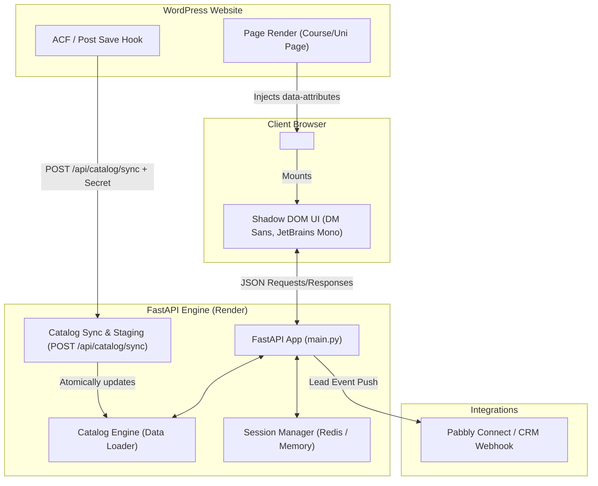

# 🎓 DegreeBaba Guided Admissions Chatbot & Widget

DegreeBaba is a catalog-grounded, chips-driven admissions assistant built for online higher education programs (MBA, MCA, BBA, BCA, etc.). It delivers an interactive, conversion-optimized guided chat experience embedded seamlessly into WordPress or any website via a zero-dependency Shadow DOM widget.

---

## 🌟 Key Features & Architecture

* **Catalog-Grounded & Hallucination-Free**: Purely deterministic navigation backed by structured catalog data (Universities, Courses, Specializations, Fees, Eligibility, EMI, Approvals, Careers).
* **Zero CSS Pollution (Shadow DOM)**: The frontend widget embeds via a single script tag and mounts into an isolated Open Shadow DOM (`host.attachShadow({ mode: 'open' })`), guaranteeing layout isolation from host websites.
* **WordPress Real-Time Catalog Sync**: Near-instant synchronization when courses or universities are edited in WordPress via the `POST /api/catalog/sync` webhook with atomic staging & versioning.
* **Pabbly Connect Lead Webhook Integration**: Captures lead forms (Name + Indian 10-digit Mobile Number) and forwards structured `CRMLeadEvent` payloads to Pabbly Connect / CRM pipelines.
* **Smart Client-Side Navigation**: Multi-step history stack (`state.historyStack`) supporting smooth `‹ Back` navigation, contextual breadcrumbs, and fee comparison tools.

---

## 🏗️ System Architecture



---

## 🚀 Live Production Environment

* **Production Backend URL**: `https://chat-bot-id1n.onrender.com`
* **Live Widget Script**: `https://chat-bot-id1n.onrender.com/widget.js`
* **Health Check Endpoint**: `https://chat-bot-id1n.onrender.com/health`

---

## 📦 Embedding the Widget

### 1. Basic / Homepage Embed

Add this script tag to your site header or footer:

```html
<!-- DegreeBaba Chatbot Widget -->
<script
    src="https://chat-bot-id1n.onrender.com/widget.js"
    data-site-key="degreebaba"
></script>
```

### 2. Specific Course / University Page Embed

To make the chatbot open with pre-loaded page context (showing fees, eligibility, and specializations specific to that page):

```html
<script
    src="https://chat-bot-id1n.onrender.com/widget.js"
    data-site-key="degreebaba"
    data-page-type="course"
    data-page-entity-slug="course-nmims-mca"
></script>
```

### 3. Dynamic WordPress PHP Embed (`header.php` / `footer.php`)

```php
<?php
$page_type = 'homepage';
$entity_slug = '';

if (is_singular('course')) {
    $page_type = 'course';
    $entity_slug = get_post_field('post_name', get_the_ID());
} elseif (is_singular('university')) {
    $page_type = 'university';
    $entity_slug = get_post_field('post_name', get_the_ID());
} elseif (is_singular('specialization')) {
    $page_type = 'specialization';
    $entity_slug = get_post_field('post_name', get_the_ID());
}
?>

<!-- DegreeBaba Chatbot Widget Script -->
<script
    src="https://chat-bot-id1n.onrender.com/widget.js"
    data-site-key="degreebaba"
    <?php if ($page_type !== 'homepage'): ?>
    data-page-type="<?php echo esc_attr($page_type); ?>"
    data-page-entity-slug="<?php echo esc_attr($entity_slug); ?>"
    <?php endif; ?>
></script>
```

---

## 🔄 WordPress Catalog Sync Integration (`POST /api/catalog/sync`)

WordPress acts as the single source of truth. When an admin edits a course, university, or specialization in WordPress, an `acf/save_post` hook sends a POST request to sync the catalog.

### Authentication
Include the `X-Webhook-Secret` header:
```http
POST /api/catalog/sync HTTP/1.1
Host: chat-bot-id1n.onrender.com
Content-Type: application/json
X-Webhook-Secret: YOUR_CONFIGURED_CATALOG_SECRET
```

### Payload Structure
```json
{
  "post_id": 1234,
  "post_type": "course",
  "status": "publish",
  "slug": "nmims-online-mba",
  "permalink": "/online-mba/nmims-online-mba",
  "modified": "2026-07-26T10:14:00Z",
  "taxonomies": {
    "program": ["online-mba"],
    "approval_body": ["ugc", "naac", "ugc-deb"]
  },
  "acf": {
    "program_name": "NMIMS Online MBA",
    "university_name": "NMIMS Global",
    "linked_university": 1180,
    "total_fee": "₹1,71,000",
    "emi_amount": "₹4,750/month",
    "duration": "24 Months",
    "eligibility_summary": "Bachelor's Degree with 50% marks"
  }
}
```

* **`status: "publish"`**: Validates, normalizes numeric fields (`fee_numeric`, `duration_months`), stages, and atomically upserts the entity.
* **`status: "trash"` / `"draft"` / `"pending"`**: Automatically removes the entity from the live catalog.

---

## 🛠️ API Reference

| Endpoint | Method | Auth | Description |
|---|---|---|---|
| `/health` | `GET` | None | Operational status and dependency health check |
| `/widget.js` | `GET` | None | Compiled bundle for the embeddable Shadow DOM widget |
| `/api/widget/guide/context` | `GET` | None | Retrieves contextual chips & entity details for initial render |
| `/api/widget/guide/chips` | `POST` | None | Executes chip actions (navigation, details, filters) |
| `/api/widget/guide/tool` | `POST` | None | Executes guided tools (scholarship checker, fee estimator) |
| `/api/widget/lead` | `POST` | None | Captures lead details and triggers Pabbly CRM webhook |
| `/api/catalog/sync` | `POST` | `X-Webhook-Secret` | Syncs WordPress catalog updates in real-time |

---

## 💻 Local Development & Testing

### Prerequisites
* Python 3.12+
* `uv` package manager (`brew install uv` or `pip install uv`)

### Setup & Installation

```bash
# Clone repository
cd chatbot

# Install dependencies
uv sync

# Run development server
uv run uvicorn main:app --reload --port 8080
```

### Running Test Suite

```bash
# Run pytest (136+ unit & integration tests)
uv run pytest
```

---

## ⚙️ Environment Variables (`.env`)

```env
# Runtime
APP_ENV=development
LOG_LEVEL=INFO

# Catalog & Sync
CATALOG_PATH=data/catalog.sample.json
CATALOG_WEBHOOK_SECRET=your_sync_secret_key_here

# Sessions & Redis
REDIS_URL=redis://localhost:6379/0
SESSION_TTL_SECONDS=1800

# Widget CORS
WIDGET_ALLOWED_ORIGINS=*

# Lead Webhook (Pabbly Connect / CRM)
CRM_WEBHOOK_URL=https://connect.pabbly.com/webhook-listener/...
CRM_WEBHOOK_SECRET=
WEBHOOK_TIMEOUT_SECONDS=5.0
```

---

## 📚 Technical Documentation Index

All architectural specs, technical reports, and redesign documents are organized in the [`docs/`](docs/) directory:

* 📄 **[Catalog Sync Dev Spec](docs/DegreeBaba-Chatbot-Catalog-Sync-Dev-Spec.md)** — WordPress webhook payload contract & sync rules.
* 📄 **[WordPress Catalog Sync Architecture](docs/WORDPRESS_CATALOG_SYNC.md)** — Comprehensive architecture design for real-time catalog syncing.
* 📄 **[System Architecture Report](docs/system%20report.md)** — Detailed overview of funnel engines, session handling, and catalog accessors.
* 📄 **[Widget AI Advisor Redesign](docs/WIDGET_AI_ADVISOR_REDESIGN.md)** — UX & UI design specifications for the chatbot widget interface.

---

*DegreeBaba Admissions Assistant Platform — Built with FastAPI & Vanilla JavaScript.*
