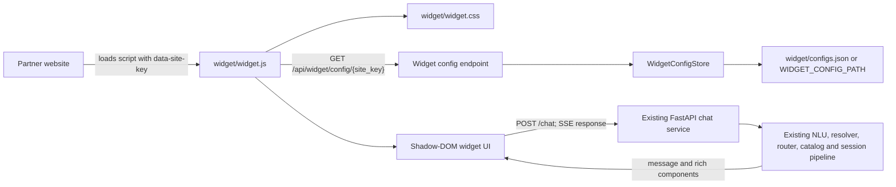
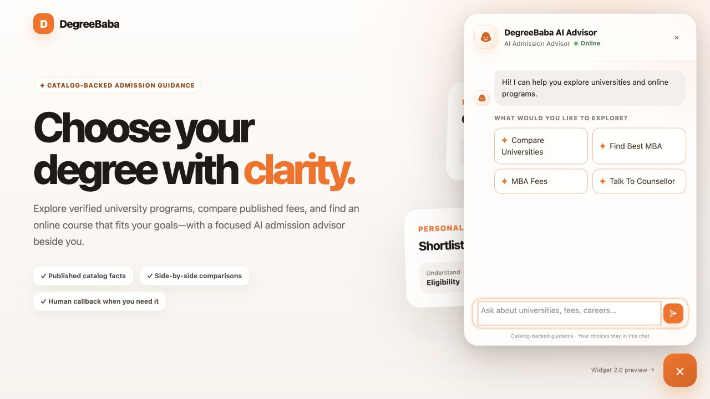
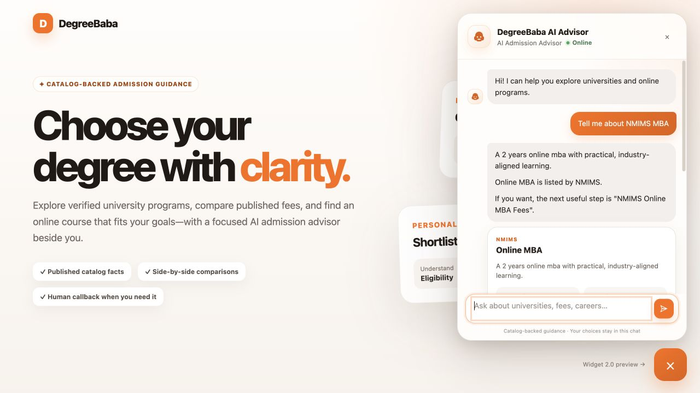
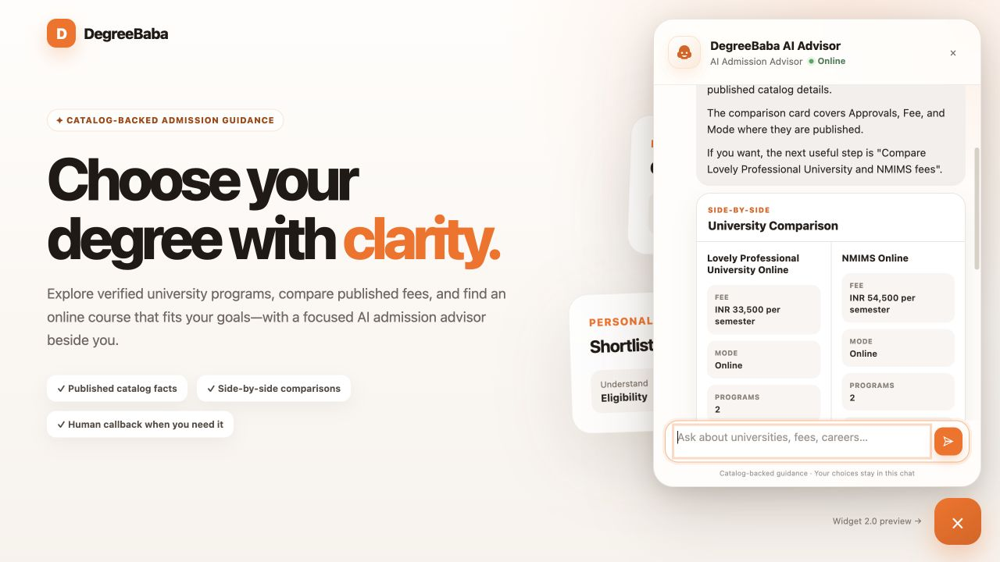

# DegreeBaba Widget 2 Architecture

Widget 2 is an additive embed layer over the existing DegreeBaba chat API. It does not
replace entity recognition, routing, catalog retrieval, session persistence, or lead and
advisor flows. The browser widget renders the canonical response payload and sends the
same `POST /chat` requests as any other client.

## Architecture



The configuration file is validated as a complete snapshot and atomically swapped. The
default store checks the file modification time before reads, so a deployment can update
branding without a Python code change. Invalid updates fail validation rather than serving
partially trusted values.

## Implemented UI previews

These captures come from the running local API and the actual embedded script—not a separate
design mockup.

### Welcome and quick actions



### Advisor-style program response



### Catalog-backed comparison card



## Embed example

```html
<script
  src="https://ai.degreebaba.com/widget.js"
  data-site-key="degreebaba"
></script>
```

On a university page, optionally add `data-page-university-slug="nmims"`. The widget forwards
both context fields on every chat turn and keeps its generated session id scoped to the
`site_key` for the current browser tab.

`site_key` is a public selector, not a credential. Authorization, origin policy, and rate
limiting must remain server-side concerns.

## Configuration file

`widget/configs.json` is keyed by the exact site key. Every entry must contain only the
seven supported fields:

```json
{
  "degreebaba": {
    "bot_name": "DegreeBaba AI Advisor",
    "avatar_url": null,
    "primary_color": "#FF6B00",
    "welcome_message": "Hi! I can help you explore universities and online programs.",
    "show_typing_indicator": true,
    "show_avatar": true,
    "auto_open": false
  }
}
```

- `primary_color` is exactly a six-digit hexadecimal color.
- `avatar_url` is `null`, an HTTP(S) URL, or a root-relative path. When it is `null`, the
  widget may render its initials/AI-mark fallback even when `show_avatar` is true.
- The three behaviour flags are strict JSON booleans; strings such as `"true"` are invalid.
- Unknown fields, malformed site keys, duplicate JSON keys, and invalid values reject the
  complete file.
- A valid but unknown site key never falls back to another tenant. `WidgetConfigStore.get()`
  raises `UnknownSiteKeyError`; the HTTP endpoint maps that to `404`.

A deployment may point the store at another file using `WIDGET_CONFIG_PATH`. This variable
is part of the application settings model; leaving it blank selects the bundled file.

A second tenant is a data-only addition—no JavaScript change is required:

```json
{
  "degreebaba": {
    "bot_name": "DegreeBaba AI Advisor",
    "avatar_url": null,
    "primary_color": "#FF6B00",
    "welcome_message": "Hi! I can help you explore universities and online programs.",
    "show_typing_indicator": true,
    "show_avatar": true,
    "auto_open": false
  },
  "partner-university": {
    "bot_name": "Partner Admission Advisor",
    "avatar_url": "https://partner.example/advisor-avatar.png",
    "primary_color": "#2457D6",
    "welcome_message": "Welcome—what would you like to know about our online programs?",
    "show_typing_indicator": true,
    "show_avatar": true,
    "auto_open": true
  }
}
```

## Configuration endpoint

`GET /api/widget/config/{site_key}` exposes the validated configuration in the public,
nested contract consumed by the widget:

```json
{
  "site_key": "degreebaba",
  "branding": {
    "bot_name": "DegreeBaba AI Advisor",
    "avatar_url": null,
    "primary_color": "#FF6B00",
    "welcome_message": "Hi! I can help you explore universities and online programs."
  },
  "behavior": {
    "show_typing_indicator": true,
    "show_avatar": true,
    "auto_open": false
  }
}
```

Endpoint behavior:

- `200` with the payload above for a configured key.
- `400` for a malformed key.
- `404` for an unknown valid key.
- `503` when the configuration file itself is invalid; do not
  silently serve another site's configuration.

The endpoint is read-only. The internal JSON file may stay flat for simple deployment edits;
`WidgetConfigStore.payload()` owns the stable nested boundary exposed to browsers.

## Chat response payload

The existing chat pipeline now presents its answer through `message` and a typed
`components` list. Components are catalog-backed; the widget renders them and does not
invent university facts in the browser. A representative response is:

```json
{
  "session_id": "session-123",
  "text": "NMIMS Online MBA\n\nOnline MBA is offered by NMIMS. ...",
  "message": "A 2-year online MBA with practical, industry-aligned learning.\n\nThis is a published Online MBA offering from NMIMS.\n\nWould you like to review the published fees for NMIMS Online MBA?",
  "suggested_chips": [
    "NMIMS Online MBA Fees",
    "NMIMS Online MBA Eligibility"
  ],
  "cta": null,
  "components": [
    {
      "type": "program_card",
      "kind": "course",
      "id": "course-nmims-mba",
      "name": "Online MBA",
      "university_name": "NMIMS",
      "category": "mba",
      "summary": "A 2 years online mba with practical, industry-aligned learning.",
      "duration": "2 Years",
      "fee": "INR 2,16,000",
      "eligibility": "Bachelor's degree in any discipline",
      "mode": "Online",
      "specializations": ["Marketing", "Business Analytics"],
      "career_outcomes": [],
      "highlights": [
        {"label": "Approvals & accreditations", "value": "UGC Entitled"}
      ]
    },
    {
      "type": "quick_actions",
      "actions": [
        {
          "label": "NMIMS Online MBA Fees",
          "message": "NMIMS Online MBA Fees",
          "action": "send_message"
        },
        {
          "label": "NMIMS Online MBA Eligibility",
          "message": "NMIMS Online MBA Eligibility",
          "action": "send_message"
        }
      ]
    }
  ]
}
```

Supported component discriminators are `university_card`, `program_card`,
`comparison_card`, `lead_cta`, and `quick_actions`. Legacy `text`, `suggested_chips`, and
`cta` fields remain available during migration so existing consumers keep working.

## Files

| File | Responsibility |
|---|---|
| `widget/widget.js` | Embed loader, configuration fetch, rendering, chat/SSE integration |
| `widget/widget.css` | Encapsulated widget presentation |
| `widget/configs.json` | Site-keyed, deployment-editable configuration |
| `widget/config.py` | Strict models, file loading, reload, and unknown-key behavior |
| `widget/demo.html` | Manual embed and interaction test page |
| `presentation/formatter.py` | Catalog-grounded advisor-style copy |
| `presentation/cards.py` | Typed university, program, comparison, CTA, and action cards |
| `presentation/response_builder.py` | Additive enrichment after existing routing completes |
| `schemas.py` | Backward-compatible rich response component contract |
| `response/builder.py` | Legacy chip/CTA mirrors for rich clients |
| `main.py` | Static/config endpoints, CORS, and presentation integration |
| `tests/test_widget_config.py` | Configuration security and reload regression coverage |
| `tests/test_widget_api.py` | Embed, endpoint, CORS, and transport integration coverage |
| `tests/test_presentation_backend.py` | Catalog grounding and structured comparison coverage |

## Migration plan

1. Deploy the additive response fields while retaining `text`, `suggested_chips`, and `cta`.
   Existing API clients ignore the unknown `message` and `components` keys and keep working.
2. Serve `/widget.js` and `/widget.css` from the existing API host or a CDN in front of it.
   Keep the stable unversioned script URL while versioning/cache-busting internal assets when
   needed.
3. Configure `widget/configs.json` or `WIDGET_CONFIG_PATH`, then verify each public `site_key`
   through `GET /api/widget/config/{site_key}`.
4. Set `WIDGET_ALLOWED_ORIGINS` to the production partner-origin allowlist. Do not treat
   `site_key` as authentication.
5. Install Widget 2 beside the existing widget on a non-production page using a temporary
   tenant key. Verify SSE, cards, quick actions, callback flow, focus continuity, and mobile
   layout.
6. Move one production site at a time to the new single-script embed. The existing `/chat`
   route, session id, `site_key`, and `page_university_slug` contract stays unchanged.
7. Monitor initialization failures, chat failures, and callback conversion during the overlap
   window. Roll back by restoring the old embed; no server data migration is required.
8. Remove the old widget only after all partner sites have moved and its traffic reaches zero.

Configuration remains presentation-only throughout migration. Any future field must be added
to the strict model, documented, and covered by tests before the browser may consume it.
