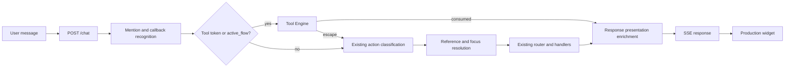
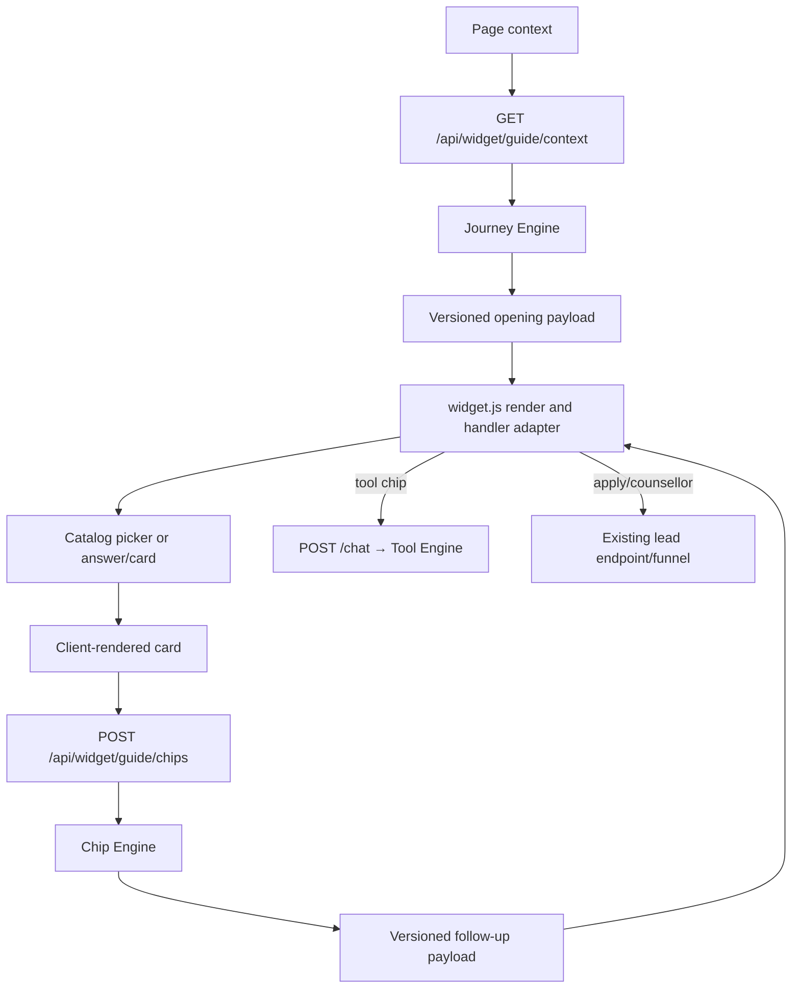
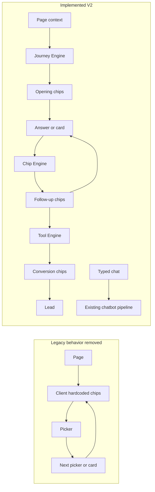
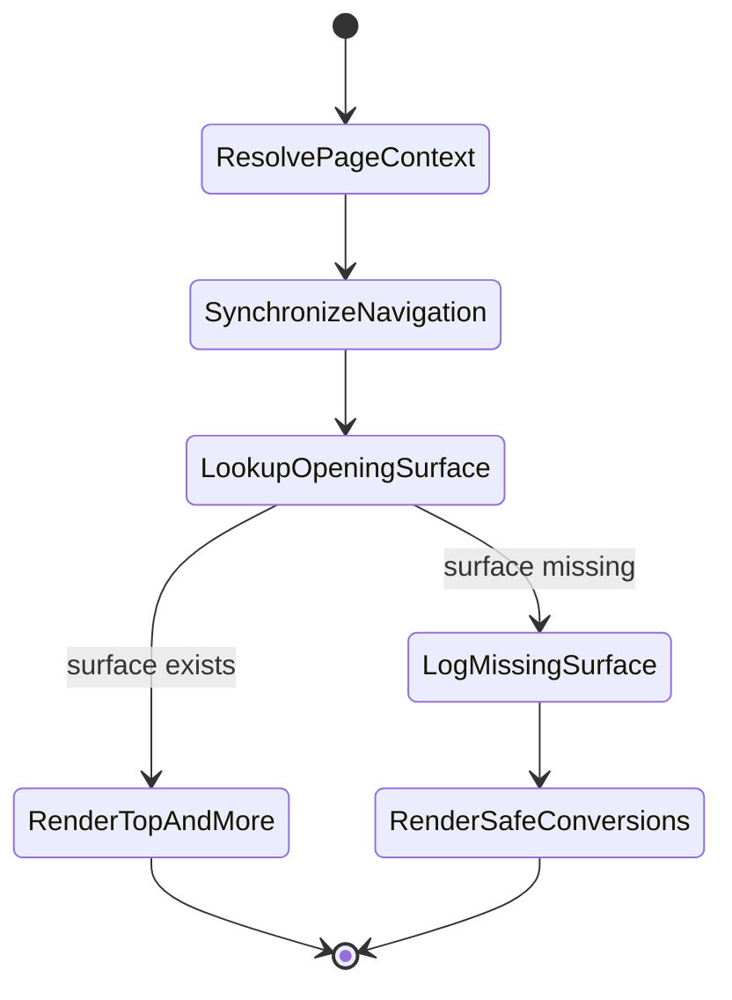
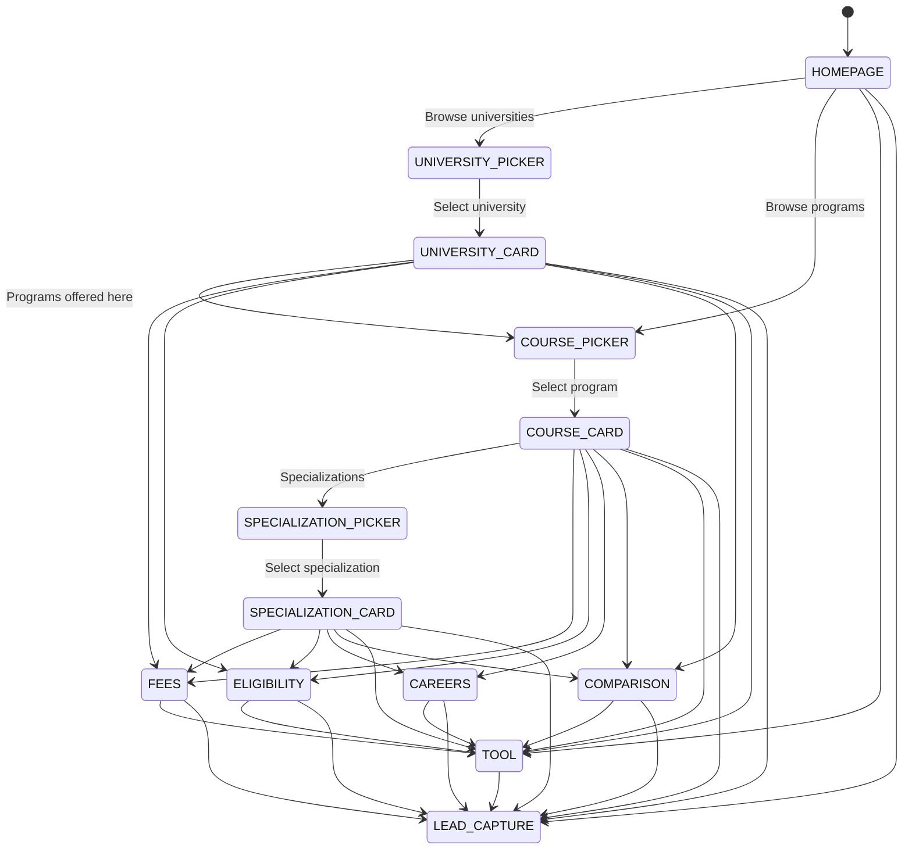
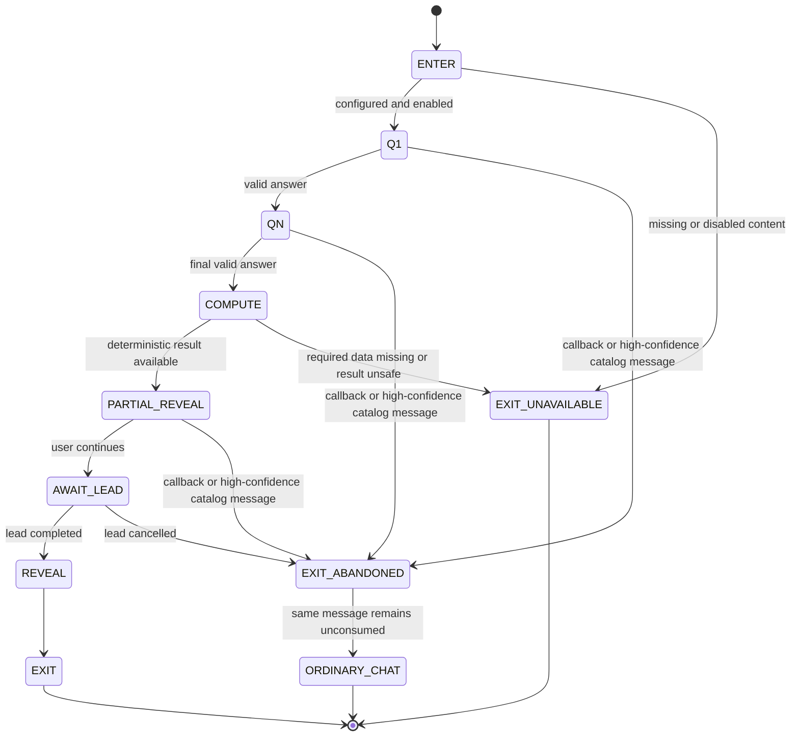
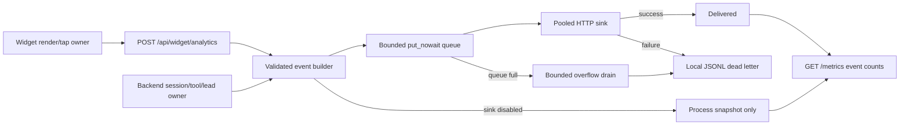

# DegreeBaba Widget V2 — Funnel Architecture

Status: implementation and integration audit, 17 July 2026

This document reconciles the Journey, Chip Map, Tools, and Analytics specifications with the code currently in this repository. The specifications remain authoritative in this order:

1. Journey specification
2. Chip Map specification
3. Tools specification
4. Analytics specification

The target is an admissions funnel layered over the existing chatbot, not a replacement for NLU, resolution, routing, catalog access, or typed chat.

## Status legend

- **Implemented** — code is connected to the production request/widget path and/or covered by a focused contract test.
- **Production content dependency** — the runtime path is present, but it intentionally refuses to fabricate a result until approved content or normalized catalog data is supplied.
- **Deferred by YAGNI** — a declared extension point is preserved without inventing behavior before its prerequisite exists.
- **Not end-to-end verified** — code inspection or component tests confirm the boundary, but a deployed browser/Redis/analytics-sink run is still required before making an operational claim.

## 1. Current architecture audit

### Implemented production path

Typed messages retain the established path, with ActiveFlow handling inserted before ordinary routing:



The guided path now uses server-owned opening and follow-up chip sets while keeping rendering and picker interaction in the dependency-free widget:



Ownership is now explicit:

- Journey Engine owns page-opening chip selection.
- Chip Engine owns post-card/post-answer progression.
- NavigationState owns persisted funnel position and entity context; the widget mirrors it for rendering.
- Tool Engine owns an active multi-turn tool lifecycle.
- The existing resolver/router continues to own ordinary typed chat.
- The widget owns actual-render and actual-tap telemetry; the backend owns tool, session, abandonment, and lead lifecycle telemetry.

### Current implementation inventory

| Area | Current status | Evidence in this repository |
|---|---|---|
| Journey configuration and opening chips | **Implemented** | `GET /api/widget/guide/context` synchronizes the session, calls `JourneyEngine.opening()`, and returns `opening_payload()`; `widget.js` renders that payload |
| Post-answer chip progression | **Implemented** | `/api/widget/guide/chips` advances persisted navigation and calls `ChipEngine.lookup()`; typed-chat response enrichment also uses Chip Engine |
| Navigation state | **Implemented** | `NavigationState`, `sync_page_navigation()`, `advance_navigation()`, endpoint persistence, and widget `transitionNavigation()` hydration |
| Course-card destination | **Implemented** | course selection renders `COURSE_CARD`; the specialization picker opens only from its explicit chip |
| No-specialization behavior | **Implemented** | widget requests `answer:no_specializations`; chip map returns same/down-funnel actions and never reopens programs |
| Tool lifecycle | **Implemented** | `/chat` enters, dispatches, replaces, or escapes ActiveFlow before ordinary routing; the lead endpoint resumes `await_lead` and returns the reveal payload |
| Tool business content | **Production content dependency** | `data/tools_content.json` intentionally disables all three tools until approved inputs exist; the live path returns an honest unavailable response |
| Tool persistence | **Implemented** | `active_flow`, answers, payload, pinned content version, and attempt ledger serialize through the existing session store |
| Analytics event contract | **Implemented** | all 14 stable events and the required key block in `analytics/events.py` |
| Analytics transport and endpoint | **Implemented** | pooled non-blocking emitter, bounded queue/dead letter, `POST /api/widget/analytics`, and lifecycle close/drain |
| Analytics emission | **Implemented** | widget emits impressions, taps, cards, cascade, Apply and Counsellor; backend emits session, tool, abandonment, and lead lifecycle events |
| Analytics metrics | **Implemented** | `GET /metrics` merges emitter delivery diagnostics and per-event counts; admin reset clears both intent and funnel snapshots |
| A/B assignment and chip fill | **Deferred by YAGNI** | config schema preserves both; runtime assignment and nearest-fee fill are intentionally absent |

### Root causes and implemented corrections

| Original root cause | Implemented correction |
|---|---|
| Duplicated hardcoded chip groups | `chip_map.json` is the group source of truth. `OPENING_ACTIONS`, `MORE_ACTIONS`, and `guidedFollowUps()` are absent from the production widget. The remaining widget maps translate stable handlers into existing UI operations; they do not choose groups. |
| Chips behaved only like catalog navigation | Answer/card surfaces call `/api/widget/guide/chips`, so each answer produces a configured next-action set. |
| Program selection forced specialization depth | `selectGuidedEntity()` renders the course card and calls the `card:course` surface. Specialization is optional. |
| Empty specialization lists moved upward | `answer:no_specializations` returns Fees, Eligibility, Admissions, Careers, and conversion actions with no course picker fallback. |
| Context and visible actions could contradict | `/guide/context` returns context, opening chips, and serialized navigation together; the widget hydrates all three from the same response. |
| No durable funnel state | `NavigationState` persists surface, entity chain, interaction depth, config version, and completed actions through SessionStore/Redis. |
| No multi-turn tool authority | `active_flow` is checked before ordinary NLU dispatch and explicitly supports replace, escape, lead gate, reveal, and exit. |
| Labels were used as analytics identity | chip payloads now carry stable ID, handler, surface, stage, config version, and content version. |
| Business scoring inputs were incomplete | tools remain disabled in production content until normalized numeric shadows, approved mappings, question banks, and reward bands are supplied. |

## 2. Legacy-to-V2 migration



The migration was additive at ownership boundaries:

1. Page context now synchronizes navigation and returns Journey Engine opening chips.
2. The widget renders configured chip payloads and delegates only the selected handler to existing picker/card functions.
3. Answer and card completions call the persisted Chip Engine endpoint for follow-ups.
4. Course selection now lands on Course Card; specialization is optional depth.
5. `/chat` gives Tool Engine first refusal after cheap recognition and before ordinary NLU routing.
6. The phone-only lead endpoint resumes an `await_lead` tool and returns its reveal payload for immediate widget rendering.
7. Widget-owned and server-owned analytics events share one validated key block and one non-blocking emitter.
8. Typed chat, catalog loading, resolver logic, and ordinary routing remain intact.

Live transport boundaries:

| Endpoint | Owner and effect |
|---|---|
| `GET /api/widget/guide/context` | resolves catalog page context, synchronizes/persists navigation, and returns Journey Engine opening chips |
| `POST /api/widget/guide/chips` | commits a completed chip action and returns Chip Engine follow-ups plus the new navigation snapshot |
| `POST /chat` | preserves ordinary chat and owns Tool Engine entry/dispatch/escape when a tool token or ActiveFlow is present |
| `POST /api/widget/lead` | captures the phone through the existing lead funnel and resumes a persisted tool at `await_lead` |
| `POST /api/widget/analytics` | validates and queues browser-owned funnel events without awaiting the external sink |
| `GET /metrics` | returns intent metrics plus funnel delivery diagnostics and event counts |

## 3. Implemented system boundaries

### Journey Engine

Purpose: select opening chips only.



Inputs are `page_type` and the resolved university/course/specialization entity chain. The engine itself consumes only page type; entity synchronization belongs to the navigation adapter.

Configured opening surfaces are:

| Page | Top actions | More actions |
|---|---|---|
| Homepage | Browse Universities; Browse Programs; Help Me Choose; Is Online Degree Valid? | Compare; Fees & EMI; ROI Calculator; Talk To Counsellor |
| University | Programs Offered Here; Approvals; Reviews; Talk To Counsellor | Starting Fees; Admission Process; Compare With Others; ROI Calculator |
| Course | Fees; Eligibility; Specializations; Apply | Validity; Careers; ROI Calculator; Scholarship Checker; Compare Universities; Counsellor |
| Specialization | Career; Fees; Eligibility; Apply | Syllabus; Other Specializations; ROI Calculator; Scholarship Checker; Counsellor |

Journey Engine must not choose post-answer chips, score tools, change NLU decisions, or route ordinary chat.

### Chip Engine

Purpose: determine follow-up chips after a card, answer, or tool reveal.

```mermaid
flowchart TD
    IN["page_type + card_type + answer_state + interaction_count"] --> KEY["Resolve chip_map surface"]
    KEY -->|"found"| LIST["Configured follow list"]
    KEY -->|"missing"| WARN["WARNING: Missing chip surface"]
    WARN --> SAFE["Safe Apply/Counsellor defaults"]
    LIST --> FILTER["Remove completed actions"]
    SAFE --> FILTER
    FILTER --> DEPTH["Remove upward-stage actions"]
    DEPTH --> CONVERT["Ensure Apply or Counsellor remains"]
    CONVERT --> ESC{ "interaction_count >= escalate_after?" }
    ESC -->|"yes"| PROMOTE["Promote first available conversion"]
    ESC -->|"no"| TOOL{"Tool reveal surface?"}
    PROMOTE --> TOOL
    TOOL -->|"yes"| PRIORITY["Order Apply, Counsellor, Compare first"]
    TOOL -->|"no"| OUT["Follow-up chip set"]
    PRIORITY --> OUT
```

Deterministic rules:

- A follow-up may stay at the same funnel stage or move down; it may never move up.
- Every configured group must contain Apply or Counsellor. Runtime safe defaults enforce that contract when a surface is missing.
- At `interaction_count >= 3`, the first available conversion chip is promoted.
- A tool reveal prioritizes Apply, Counsellor, then Compare.
- A completed chip ID or handler is not immediately repeated in the same persisted journey.
- A missing surface logs `Missing chip surface` and returns safe conversion actions; it never silently uses an unrelated page group.
- Journey Engine owns page opening. A page-only request to Chip Engine is intentionally treated as a missing follow-up surface.

**Deferred by YAGNI:** per-entity label fill and runtime A/B assignment are not executed. Their schema is retained so approved numeric data and attribution can be added without changing the chip contract.

### Navigation state machine

Purpose: keep context, visible surface, interaction depth, and completed actions in one serializable state.



The context chip must be derived from the same `NavigationState` entity chain used to produce the visible surface. A course selection lands on `COURSE_CARD`; it never implies a specialization. If `specializations == []`, the course stays authoritative and the next surface contains Fees, Eligibility, Admissions, Careers, plus Apply/Counsellor. No picker is reopened.

### Tool Engine

Purpose: own a configured, deterministic multi-turn tool without changing funnel progression rules.



Lifecycle authority is `ConversationState.active_flow`:

- `tool`: `roi`, `career_quiz`, or `scholarship`;
- `step`: current question or lifecycle state;
- `answers` and normalized answer payload;
- pinned content `version`.

The state is serialized by the existing `SessionStore`, so it can survive memory-session reload and Redis persistence without a separate store.

Escape is mandatory. A callback request or a high-confidence catalog entity request abandons the active tool, emits/records `flow_abandoned`, and lets the same message continue through ordinary chat. Starting another tool replaces the current one explicitly.

Tool computation contracts:

- **ROI:** requires normalized `fee_numeric`, unambiguous normalized `salary_numeric`, and a supplied current salary period. It computes `delta_salary = post_salary - current_salary`, `monthly_delta = delta_salary / 12`, then `payback_months = ceil(fee / monthly_delta)`. A non-positive delta produces `cannot_compute`; gross salary is never presented as payback.
- **Career Quiz:** requires 5–7 configured questions with option-to-discipline weights and a connected discipline-to-program lookup. Scores are summed. A tie returns `cannot_compute` because the specification supplies no tie-break rule.
- **Scholarship Checker:** requires a program-specific seven-question bank and reward bands that cover the result exactly once. The session ledger prevents a second completed attempt in one session.

The one-attempt-per-phone rule is enforced when a scholarship result reaches its lead gate. `SessionStore.claim_once()` hashes the normalized phone before storage and uses Redis `SET NX` for atomic cross-session/cross-process enforcement. Local development and sticky Redis-degraded mode use the same hashed key in process memory; production therefore requires Redis for enforcement across multiple workers or restarts.

### Analytics

Purpose: observe the funnel without adding latency or changing a user-visible result.



All events carry the complete joinable key block:

```text
session_id
correlation_id
ts
event
surface
funnel_stage
interaction_count
entity: { type, id }
config_version
content_version
```

The stable event set is:

```text
chip_shown
chip_tapped
card_shown
cascade_step
tool_started
tool_step
tool_partial_reveal
tool_lead_gate
tool_completed
lead_captured
apply_clicked
counsellor_clicked
session_start
flow_abandoned
```

`chip_shown` is one batched event for a rendered group, not one request per chip. The emitter validates synchronously, queues with `put_nowait`, reuses one HTTP client, and handles sink failures through a bounded dead-letter path. It never awaits network or filesystem I/O from the chat response path.

Event ownership is implemented as follows:

- the widget endpoint accepts the six events only the browser can observe accurately: `chip_shown`, `chip_tapped`, `card_shown`, `cascade_step`, `apply_clicked`, and `counsellor_clicked`;
- the backend emits `session_start`, all tool lifecycle events, `flow_abandoned`, and `lead_captured` at their authoritative transitions;
- every event is built with the same correlation/session/surface/stage/entity/version key block;
- `/metrics` exposes emitter counts and delivery diagnostics, and `/admin/metrics/reset` resets the funnel snapshot with the intent snapshot.

External sink delivery, deployed dead-letter permissions, and dashboard interpretation remain operational verification work; the endpoint, emission sites, in-process counts, and failure path are implemented and covered by focused tests.

## 4. Persistence and synchronization contract

The persisted state additions are intentionally small:

```text
ConversationState
├── navigation
│   ├── step
│   ├── page_type / surface
│   ├── entity_id / university_id / course_id / specialization_id
│   ├── interaction_count
│   ├── completed_actions[]
│   └── config_version
├── active_flow?
│   ├── tool
│   ├── step
│   ├── answers{}
│   ├── payload{}
│   └── version
└── tool_attempts{}
```

Implemented synchronization rules:

1. `/guide/context` resolves the page entity and atomically updates page type, surface, step, entity IDs, and config version with `sync_page_navigation()`.
2. The widget renders context and opening chips from that same response and hydrates the returned navigation snapshot.
3. `/guide/chips` calls `advance_navigation()` once for the completed guided action, records its stable chip ID, increments guided depth, looks up the next surface, and persists before responding.
4. `/chat` records either one typed-turn depth increment or one supplied stable `chip_id`, never both. Catalog-only guided answers use `/guide/chips`; actions that intentionally reuse typed chat carry their chip ID in that single `/chat` request so completion and navigation remain authoritative without a second request.
5. Tool `ENTER` pins the current content version; every following dispatch reloads that version rather than silently changing question/scoring content mid-flow.
6. `active_flow` clears only on reveal, explicit abandonment/replacement, unavailable content, or lead cancellation.
7. The widget stores the session ID in session storage and the backend serializes `ConversationState`; refresh and Redis reload do not depend on reconstructing tool answers from the DOM.

## 5. Graceful unavailable-content contract

Missing information must be visible and non-fabricated.

| Condition | Required behavior |
|---|---|
| Chip surface missing | Log `Missing chip surface`; render safe Apply/Counsellor defaults |
| Chip config reload invalid | Keep the last valid snapshot; log the reload failure |
| Initial chip config invalid | Fail startup/configuration clearly; do not invent a map |
| Tool disabled or questions absent | Clear the attempted flow; explain that configured content is unavailable; offer Counsellor and Continue Exploring |
| Pinned tool version no longer retained | Exit honestly; do not score against a different version |
| ROI numeric fields absent or ambiguous | Return unavailable; never parse display strings or infer salary |
| ROI salary delta non-positive | Return `cannot_compute`; do not present misleading payback |
| Career mapping absent or tied | Return unavailable/`cannot_compute`; do not invent a discipline or tie-breaker |
| Scholarship bank/reward coverage incomplete | Return unavailable; do not guess a score or waiver |
| No course specializations | Stay on Course Card and show same/down-funnel answers and conversion actions |
| Analytics sink unavailable | Keep the user path successful; queue/dead-letter outside the response path |

`data/tools_content.json` is intentionally a disabled manifest. It documents why each tool is unavailable and prevents a demo configuration from being mistaken for approved production advice.

## 6. Files added and modified in this implementation

This is the repository state at the time of this audit.

### Added

| File | Responsibility |
|---|---|
| `data/chip_map.json` | Versioned opening and follow-up chip surfaces plus progression policy |
| `funnel/chip_config.py` | Strict config models, handler validation, atomic hot reload, last-good snapshot |
| `funnel/engine.py` | Journey Engine, Chip Engine, completed/upward filtering, conversion promotion |
| `funnel/__init__.py` | Funnel public API |
| `presentation/chips.py` | Config chip to `QuickAction` transport adapter |
| `session/navigation.py` | Central page/chip transition tables and state synchronization helpers |
| `routing/tools/content.py` | Strict, versioned, hot-reloadable tool content store |
| `routing/tools/base.py` | Active-flow lifecycle, escape, lead gate, reveal, and unavailable states |
| `routing/tools/roi.py` | Salary-delta ROI computation |
| `routing/tools/career_quiz.py` | Configured weighted career scoring |
| `routing/tools/scholarship.py` | Seven-question/reward-band scholarship scoring |
| `routing/tools/__init__.py` | Tool public API |
| `data/tools_content.json` | Explicitly disabled manifest for unavailable production content/data |
| `analytics/events.py` | Stable event constants, full-key validation, event builders |
| `analytics/emitter.py` | Non-blocking delivery, pooled HTTP client, bounded queue, dead letter |
| `analytics/__init__.py` | Analytics public API |
| `tests/test_funnel_engines.py` | Opening, progression, no-specialization, missing-surface, reload, and schema tests |
| `tests/test_tools_framework.py` | Tool lifecycle, computation, persistence, escape, and unavailable-content tests |
| `tests/test_analytics_emitter.py` | Contract, non-blocking delivery, dead-letter, and shutdown tests |
| `tests/test_widget_v2_funnel_integration.py` | Live endpoint/session/tool escape/lead resume/metrics integration tests |

### Modified

| File | Responsibility added |
|---|---|
| `session/state.py` | `NavigationStep`, `NavigationState`, `ActiveFlow`, and tool attempt ledger |
| `session/__init__.py` | Exports the new persisted state models |
| `session/store.py` | Privacy-safe atomic one-attempt claims, using Redis with a process-memory degraded fallback |
| `schemas.py` | Stable chip metadata and widget request contracts |
| `presentation/response_builder.py` | Config-driven post-answer Chip Engine adapter when supplied |
| `presentation/formatter.py` | Natural next-step copy for config-driven fee actions |
| `leads/funnel.py` | Name-and-phone tool gate support plus validated tool result tags in the existing CRM context |
| `nlu/action_classifier.py` | Deterministic tool-entry action and tool ID parsing |
| `main.py` | Engine ownership; guide context/chip/analytics endpoints; ActiveFlow dispatch/escape; lead resume; event emissions; merged metrics |
| `widget/widget.js` | Server-driven opening/follow-up chips, navigation hydration, course-card-first flow, tool/lead handling, and browser-owned analytics |
| `tests/test_funnel.py` | Existing lead-funnel compatibility plus tool-gate name/tag coverage |
| `tests/test_presentation_backend.py` | Tool reveal cards and config-driven action metadata coverage |
| `tests/test_session_store.py` | Redis/process-memory one-attempt claim coverage |
| `tests/test_widget_2_contract.py` | Production widget contract coverage for server-driven chips, no-specialization flow, telemetry, and tool reveal rendering |
| `config.py` | Chip-map, tools-content, and non-blocking analytics settings |
| `.env.example` | Corresponding deployment configuration |

### Remaining production data and operational dependencies

The engine/widget wiring is present. The remaining blockers are inputs that the supplied specifications and current catalog do not provide:

- add normalized `fee_numeric` and unambiguous `salary_numeric` shadows for ROI-eligible programs;
- author and approve ROI questions, the 5–7 Career Quiz questions, option-to-discipline weights, and discipline-to-published-program mappings;
- author and approve per-program seven-question Scholarship banks and non-overlapping reward bands;
- configure Redis in production so the phone-scoped Scholarship guard remains durable across workers and restarts;
- configure and exercise the external analytics webhook, dead-letter filesystem permissions, and production dashboards.

Until the first three content/data items are supplied, `data/tools_content.json` keeps the corresponding tools disabled and the live tool path returns its configured unavailable explanation. That is deliberate safe behavior, not missing engine wiring.

When a lead gate is completed, the validated `ToolResult.lead_tags` are merged into the
existing CRM event `context` alongside the widget source. No parallel CRM transport or
tool-specific lead endpoint was introduced.

## 7. Verification matrix

| Journey | Deterministic assertion |
|---|---|
| Homepage | Journey Engine returns homepage Top and More groups; no post-answer lookup is involved |
| University | Opening surface is university-specific; Programs Offered Here leads to course selection, then Course Card |
| Course | Course Card is primary; Specializations is optional; no-specialization stays at course depth |
| Specialization | Bottom-stage actions never move to browse/program surfaces |
| Fees | Follow-up is config-owned, excludes completed Fees, contains conversion, and cannot move upward |
| Eligibility | Yes/borderline/no answer state selects the corresponding configured follow-up surface |
| ROI | Missing numeric data is unavailable; configured numeric data uses salary-delta payback only |
| Career Quiz | Only complete configured weights and a unique winning discipline can reveal mapped programs |
| Scholarship | Exactly seven configured questions and one matching reward band are required |
| Apply | Moves to `LEAD_CAPTURE` and records a stable Apply action/event |
| Counsellor | Moves to `LEAD_CAPTURE` through the existing lead funnel |
| Tool exit | Callback or high-confidence catalog request abandons the tool and the same message continues through chat |
| Refresh | Navigation, completed actions, active flow, answers, and pinned version round-trip through `ConversationState` |
| Analytics outage | User response completes; event delivery fails outside the response path and reaches dead letter |

Focused unit and integration tests cover Journey/Chip rules, persisted navigation, the guide endpoints, unavailable production tool content, configured multi-turn tool escape/resume, widget server-driven contracts, batched analytics ingestion, and merged metrics. A deployed browser run with Redis, approved tool content, CRM, and the external analytics sink is still required for operational verification; it is not an implementation-wiring blocker.

Final local verification on 17 July 2026: `pytest -q` completed with **578 passed**; changed Python files passed Ruff; `widget/widget.js` passed `node --check`; changed Python modules passed bytecode compilation; and `git diff --check` passed. The test run reported one upstream Google GenAI SDK deprecation warning and no test failures.

## 8. YAGNI guardrails

- Do not rewrite NLU, resolver, router, catalog schema, or typed chat to implement the funnel.
- Do not add another state store; reuse serializable `ConversationState` and the existing `SessionStore`.
- Do not create another lead capture system; adapt the existing lead funnel.
- Do not invent tool questions, answers, weights, reward bands, salaries, fees, application URLs, or conversion claims.
- Do not enable A/B selection before assignment persistence and analytics attribution are connected.
- Do not implement dynamic chip fill until the required normalized catalog data exists.
- Do not add retries to the user response path for analytics.
- Do not reintroduce client-owned chip groups; widget maps may translate stable handlers but must not choose progression surfaces.

The smallest complete production shape is therefore:

```text
Page → Journey Engine → Opening Chips
Answer/Card → Chip Engine → Follow-up Chips
Tool Chip → ActiveFlow → Partial Reveal → Existing Lead Funnel → Reveal
Every surface → non-blocking analytics
Typed message → unchanged chatbot pipeline
```
