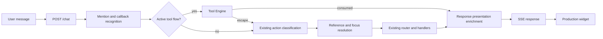
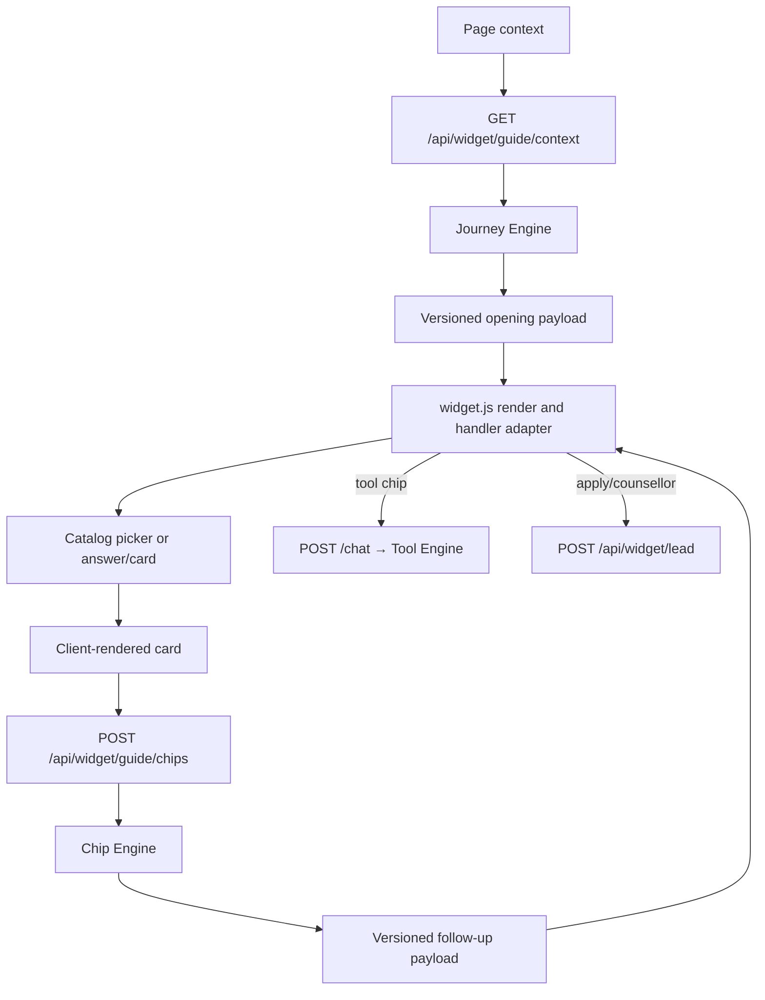

# DegreeBaba Chatbot: Comprehensive System Architecture & Codebase Analysis

This document provides a complete technical analysis of the DegreeBaba Chatbot. It maps out the directories, classes, functions, and communication mechanisms of the codebase. Every item is cross-referenced with exact links to the files on disk, ensuring absolute alignment with the active code.

---

## 1. Directory Structure

The `chatbot` workspace consists of a highly modular, decoupled pipeline layout:

```
chatbot/
├── main.py
├── config.py
├── schemas.py
├── logging_setup.py
├── index.html
├── data/
│   ├── accessor.py
│   ├── loader.py
│   ├── catalog.sample.json
│   ├── chip_map.json
│   ├── tools_content.json
│   └── models/
│       ├── __init__.py
│       ├── university.py
│       ├── course.py
│       └── specialization.py
├── funnel/
│   ├── __init__.py
│   ├── chip_config.py
│   └── engine.py
├── session/
│   ├── state.py
│   ├── store.py
│   └── navigation.py
├── nlu/
│   ├── action_classifier.py
│   ├── callback_detector.py
│   ├── intent.py
│   └── mention_extractor.py
├── taxonomy/
│   ├── alias_tables.py
│   ├── ambiguity_clusters.py
│   ├── category_index.py
│   ├── entity_matcher.py
│   ├── fuzzy_bucket.py
│   ├── index_builder.py
│   └── ngram_matcher.py
├── resolver/
│   ├── reference_resolver.py
│   ├── focus_updater.py
│   ├── clarifier.py
│   └── pending_clarification.py
├── routing/
│   ├── router.py
│   ├── factual_handler.py
│   ├── category_handler.py
│   ├── clarification_handler.py
│   ├── comparison_handler.py
│   ├── discovery_handler.py
│   ├── advisory_handler.py
│   ├── list_handler.py
│   ├── knowledge_handler.py
│   ├── unsupported_handler.py
│   ├── validation_handler.py
│   ├── fallback_handler.py
│   └── tools/
│       ├── __init__.py
│       ├── base.py
│       ├── roi.py
│       ├── career_quiz.py
│       ├── scholarship.py
│       └── content.py
├── response/
│   ├── builder.py
│   ├── cta.py
│   ├── cards.py
│   └── templates.py
├── presentation/
│   ├── __init__.py
│   ├── cards.py
│   ├── chips.py
│   ├── formatter.py
│   └── response_builder.py
├── widget/
│   ├── __init__.py
│   ├── config.py
│   ├── configs.json
│   ├── demo.html
│   ├── widget.css
│   └── widget.js
├── leads/
│   ├── funnel.py
│   ├── webhook.py
│   └── crm_schema.py
├── llm/
│   ├── client.py
│   └── prompts.py
├── analytics/
│   ├── __init__.py
│   ├── events.py
│   └── emitter.py
└── resilience/
    ├── health.py
    └── intent_metrics.py
```

---

## 2. Request Lifecycle & Architecture Flows

### 2.1 Typed Messages Chat Route
Typed messages retain the established pipeline, with the Tool Engine checking for active multi-turn flows before NLU dispatch:



### 2.2 Guided Funnel Flow
The guided path uses server-owned opening and follow-up chip sets while maintaining state synchronization:



---

## 3. Module-by-Module Code Analysis

### 3.1 Root Level Configuration & Service Entry

#### [main.py](file:///Users/aryankinha/Documents/Degree/CHAT%20BOT/chatbot/main.py)
*   **Purpose**: Main API endpoint entry point using FastAPI. Coordinates HTTP server startup, connection checks, session persistence hookups, chat payload streaming, and diagnostic metric routes.
*   **Key Components**:
    *   `lifespan` ([main.py:L40](file:///Users/aryankinha/Documents/Degree/CHAT%20BOT/chatbot/main.py#L40)): Async context manager that initializes settings, database models, LLM clients, session store connection pools, catalog loaders, and precompiles taxonomy indexes.
    *   `ChatbotService` ([main.py:L82](file:///Users/aryankinha/Documents/Degree/CHAT%20BOT/chatbot/main.py#L82)): Central workflow orchestrator. Combines session loading, NLU detection, active tool flow dispatching, action classification, taxonomy slots matching, context updating, and routes dispatching.
    *   `POST /chat` ([main.py:L397](file:///Users/aryankinha/Documents/Degree/CHAT%20BOT/chatbot/main.py#L397)): Accepts a `ChatRequest` and streams a `StreamingResponse` using Server-Sent Events (SSE).
    *   `GET /health` ([main.py:L427](file:///Users/aryankinha/Documents/Degree/CHAT%20BOT/chatbot/main.py#L427)): Probes external databases, cache servers, and LLM integrations.
    *   `GET /metrics` ([main.py:L865](file:///Users/aryankinha/Documents/Degree/CHAT%20BOT/chatbot/main.py#L865)): Exposes a JSON snapshot of intent classification volumes, latencies, and fallback sources.
    *   `POST /admin/metrics/reset` ([main.py:L871](file:///Users/aryankinha/Documents/Degree/CHAT%20BOT/chatbot/main.py#L871)): Authorizes an administrator to clear metric epochs.
    *   `POST /admin/reindex` ([main.py:L433](file:///Users/aryankinha/Documents/Degree/CHAT%20BOT/chatbot/main.py#L433)): Re-downloads the catalog database and rebuilds the search indices in background memory.
*   **Core Imports**: `fastapi`, `pydantic`, `sse_starlette`, `config`, `logging_setup`, `session.store`, `data.loader`, `nlu.mention_extractor`, `taxonomy.entity_matcher`, `resolver.focus_updater`, `routing.router`, `resilience.health`, `resilience.intent_metrics`.

#### [config.py](file:///Users/aryankinha/Documents/Degree/CHAT%20BOT/chatbot/config.py)
*   **Purpose**: Manages configuration parsing via `pydantic-settings`.
*   **Key Components**:
    *   `Settings` ([config.py:L16](file:///Users/aryankinha/Documents/Degree/CHAT%20BOT/chatbot/config.py#L16)): Loads variables from `.env` with fallback defaults. Includes connection credentials for Redis, Groq, OpenAI, Gemini model targets (`gemini_model`, `gemini_intent_timeout_ms`), catalog files, and webhook parameters.
*   **Core Imports**: `pydantic_settings.BaseSettings`, `pydantic.Field`.

#### [schemas.py](file:///Users/aryankinha/Documents/Degree/CHAT%20BOT/chatbot/schemas.py)
*   **Purpose**: Hosts the structure schemas for payloads returned by HTTP endpoints.
*   **Key Components**:
    *   `ChatRequest` ([schemas.py:L19](file:///Users/aryankinha/Documents/Degree/CHAT%20BOT/chatbot/schemas.py#L19)): Schema for message requests.
    *   `CtaPayload` ([schemas.py:L27](file:///Users/aryankinha/Documents/Degree/CHAT%20BOT/chatbot/schemas.py#L27)): Call to Action detail payload structure (includes target action, titles, and link URIs).
    *   `ResponsePayload` ([schemas.py:L34](file:///Users/aryankinha/Documents/Degree/CHAT%20BOT/chatbot/schemas.py#L34)): Response returned by standard chatbot routes.
*   **Core Imports**: `pydantic.BaseModel`.

#### [logging_setup.py](file:///Users/aryankinha/Documents/Degree/CHAT%20BOT/chatbot/logging_setup.py)
*   **Purpose**: Centralizes turn trace outputs. Assigns unique session correlation IDs.
*   **Key Components**:
    *   `LOGGERS` ([logging_setup.py:L17](file:///Users/aryankinha/Documents/Degree/CHAT%20BOT/chatbot/logging_setup.py#L17)): Dict of independent loggers mapped to application components.
    *   `correlation_id` ([logging_setup.py:L27](file:///Users/aryankinha/Documents/Degree/CHAT%20BOT/chatbot/logging_setup.py#L27)): Combines transaction turn counts with the tail of the session ID.
    *   `TurnLogger` ([logging_setup.py:L83](file:///Users/aryankinha/Documents/Degree/CHAT%20BOT/chatbot/logging_setup.py#L83)): Inserts correlation context to standard log handlers.
*   **Core Imports**: `logging`, `json`, `sys`.

---

### 3.2 Session Layer

#### [session/state.py](file:///Users/aryankinha/Documents/Degree/CHAT%20BOT/chatbot/session/state.py)
*   **Purpose**: Structure schemas representing the conversation state of active users.
*   **Key Components**:
    *   `Focus` ([session/state.py:L13](file:///Users/aryankinha/Documents/Degree/CHAT%20BOT/chatbot/session/state.py#L13)): Active topic model containing the resolved slots (e.g. `university_id`, `category`, `specialization_id`).
    *   `PendingClarification` ([session/state.py:L25](file:///Users/aryankinha/Documents/Degree/CHAT%20BOT/chatbot/session/state.py#L25)): Stores options to present during a clarification flow.
    *   `LeadFunnelState` ([session/state.py:L36](file:///Users/aryankinha/Documents/Degree/CHAT%20BOT/chatbot/session/state.py#L36)): Contact extraction state tracks name, email, and phone collection.
    *   `ConversationState` ([session/state.py:L40](file:///Users/aryankinha/Documents/Degree/CHAT%20BOT/chatbot/session/state.py#L40)): Full state object holding the session history, active focus, lead details, turn counter, conversation context, navigation state, and active tool flow.
*   **Core Imports**: `pydantic.BaseModel`, `session.state.Focus`, `session.state.PendingClarification`.

#### [session/store.py](file:///Users/aryankinha/Documents/Degree/CHAT%20BOT/chatbot/session/store.py)
*   **Purpose**: Manages persisting, updating, and expiring conversation states using Redis or local memory.
*   **Key Components**:
    *   `SessionStore` ([session/store.py:L19](file:///Users/aryankinha/Documents/Degree/CHAT%20BOT/chatbot/session/store.py#L19)): Implements get, set, delete, and health check actions. Falls back to a local memory cache if Redis is down. Implements `claim_once()` using Redis atomic locks to enforce one-time lead claims.
*   **Core Imports**: `redis.asyncio`, `json`, `session.state.ConversationState`.

#### [session/navigation.py](file:///Users/aryankinha/Documents/Degree/CHAT%20BOT/chatbot/session/navigation.py)
*   **Purpose**: Coordinates navigation-state transitions, steps, and pages on the server side.
*   **Key Components**:
    *   `PAGE_SURFACES` & `PAGE_STEPS` ([session/navigation.py:L10](file:///Users/aryankinha/Documents/Degree/CHAT%20BOT/chatbot/session/navigation.py#L10)): Maps context type to analytics surfaces and navigation steps.
    *   `sync_page_navigation` ([session/navigation.py:L90](file:///Users/aryankinha/Documents/Degree/CHAT%20BOT/chatbot/session/navigation.py#L90)): Synchronizes the active page parameters into the serializable session state.
    *   `advance_navigation` ([session/navigation.py:L142](file:///Users/aryankinha/Documents/Degree/CHAT%20BOT/chatbot/session/navigation.py#L142)): Processes completed action tags and updates interaction metrics.
*   **Core Imports**: `session.state.ConversationState`, `session.state.NavigationState`, `session.state.NavigationStep`.

---

### 3.3 Catalog Data Ingestion & Models

#### [data/loader.py](file:///Users/aryankinha/Documents/Degree/CHAT%20BOT/chatbot/data/loader.py)
*   **Purpose**: Ingests, parses, and caches data records from local JSON files or remote URLs.
*   **Key Components**:
    *   `CatalogStore` ([data/loader.py:L113](file:///Users/aryankinha/Documents/Degree/CHAT%20BOT/chatbot/data/loader.py#L113)): Connects, fetches, parses envelopes via `parse_entity`, updates memory stores, and compiles the taxonomy indices.
*   **Core Imports**: `httpx`, `pydantic`, `data.models.parse_entity`, `taxonomy.index_builder.build_indexes`.

#### [data/accessor.py](file:///Users/aryankinha/Documents/Degree/CHAT%20BOT/chatbot/data/accessor.py)
*   **Purpose**: Utility library providing helper utilities to parse catalog nodes.
*   **Key Components**:
    *   `CatalogAccessor` ([data/accessor.py:L16](file:///Users/aryankinha/Documents/Degree/CHAT%20BOT/chatbot/data/accessor.py#L16)): Fast search utilities (e.g. finding courses by university, listing specializations, checking UGC status, NAAC grade, or retrieving lists of categories).
*   **Core Imports**: `data.models.university`, `data.models.course`, `data.models.specialization`.

#### [data/models/__init__.py](file:///Users/aryankinha/Documents/Degree/CHAT%20BOT/chatbot/data/models/__init__.py)
*   **Purpose**: Entrypoint for Pydantic document parsing.
*   **Key Components**:
    *   `parse_entity` ([data/models/__init__.py:L61](file:///Users/aryankinha/Documents/Degree/CHAT%20BOT/chatbot/data/models/__init__.py#L61)): Inspects the envelope `_meta.page_type` and instantiates the correct model.
*   **Core Imports**: `data.models.university.University`, `data.models.course.Course`, `data.models.specialization.Specialization`.

---

### 3.4 Admissions Funnel Engine

#### [funnel/chip_config.py](file:///Users/aryankinha/Documents/Degree/CHAT%20BOT/chatbot/funnel/chip_config.py)
*   **Purpose**: Evaluates, parses, and validates the configuration of active chip maps with thread-safe hot-reload checks.
*   **Key Components**:
    *   `ChipDefinition` ([funnel/chip_config.py:L71](file:///Users/aryankinha/Documents/Degree/CHAT%20BOT/chatbot/funnel/chip_config.py#L71)): Config details validating handlers, A/B variants, pre-filled attributes, and dependency constraints.
    *   `ChipMapConfig` ([funnel/chip_config.py:L124](file:///Users/aryankinha/Documents/Degree/CHAT%20BOT/chatbot/funnel/chip_config.py#L124)): Central schema validating the integrity of the full chip-map.
    *   `ChipMapStore` ([funnel/chip_config.py:L153](file:///Users/aryankinha/Documents/Degree/CHAT%20BOT/chatbot/funnel/chip_config.py#L153)): Manages memory cache lock layers and atomic hot reloads from local configuration files.
*   **Core Imports**: `pydantic.BaseModel`, `pydantic.model_validator`.

#### [funnel/engine.py](file:///Users/aryankinha/Documents/Degree/CHAT%20BOT/chatbot/funnel/engine.py)
*   **Purpose**: Core engine that determines the opening and follow-up chip lists based on target context variables.
*   **Key Components**:
    *   `JourneyEngine` ([funnel/engine.py:L157](file:///Users/aryankinha/Documents/Degree/CHAT%20BOT/chatbot/funnel/engine.py#L157)): Resolves opening chips for specific landing pages (Homepage, Course, University, Specialization).
    *   `ChipEngine` ([funnel/engine.py:L218](file:///Users/aryankinha/Documents/Degree/CHAT%20BOT/chatbot/funnel/engine.py#L218)): Implements deterministic follow-up logic. Enforces stage checks, filters completed options, promotes conversion paths at deep interactions, and orders tool reveal chips.
*   **Core Imports**: `funnel.chip_config.ChipMapStore`, `funnel.engine.ResolvedChip`.

#### [data/chip_map.json](file:///Users/aryankinha/Documents/Degree/CHAT%20BOT/chatbot/data/chip_map.json)
*   **Purpose**: The central declarative config registry defining all chip metadata, target surfaces, flow-direction requirements, and conversion priorities.

---

### 3.5 Natural Language Understanding (NLU)

#### [nlu/callback_detector.py](file:///Users/aryankinha/Documents/Degree/CHAT%20BOT/chatbot/nlu/callback_detector.py)
*   **Purpose**: Detects requests to speak with a human or request a callback. Always runs before the LLM router to minimize API overhead.
*   **Key Components**:
    *   `_fuzzy_human_match` ([nlu/callback_detector.py:L69](file:///Users/aryankinha/Documents/Degree/CHAT%20BOT/chatbot/nlu/callback_detector.py#L69)): Employs RapidFuzz token matching to catch spelling errors (e.g. `concellor`, `counsular`).
    *   `is_callback_request` ([nlu/callback_detector.py:L78](file:///Users/aryankinha/Documents/Degree/CHAT%20BOT/chatbot/nlu/callback_detector.py#L78)): Checks regex rules and fuzzy verbs (e.g. `talk counselor`, `request callback`).
*   **Core Imports**: `re`, `rapidfuzz.fuzz`.

#### [nlu/action_classifier.py](file:///Users/aryankinha/Documents/Degree/CHAT%20BOT/chatbot/nlu/action_classifier.py)
*   **Purpose**: Pure action selector that operates over resolved catalog mentions and bounded regex phrase markers to bypass LLM requests.
*   **Key Components**:
    *   `Action` ([nlu/action_classifier.py:L10](file:///Users/aryankinha/Documents/Degree/CHAT%20BOT/chatbot/nlu/action_classifier.py#L10)): StrEnum defining query actions (e.g. `GET_FACTS`, `LIST_SPECIALIZATIONS`, `LIST_PROVIDERS`, `COMPARE`, `RECOMMEND`, `CALLBACK`, `UNSUPPORTED_ENTITY`).
    *   `classify` ([nlu/action_classifier.py:L94](file:///Users/aryankinha/Documents/Degree/CHAT%20BOT/chatbot/nlu/action_classifier.py#L94)): Inspects candidate lists. Returns a deterministic Action or `None` if the input must be escalated to Gemini.
*   **Core Imports**: `re`, `enum.StrEnum`.

#### [nlu/intent.py](file:///Users/aryankinha/Documents/Degree/CHAT%20BOT/chatbot/nlu/intent.py)
*   **Purpose**: Classifies user messages into intents using Gemini when local heuristic rules do not apply.
*   **Key Components**:
    *   `decide_action` ([nlu/intent.py:L116](file:///Users/aryankinha/Documents/Degree/CHAT%20BOT/chatbot/nlu/intent.py#L116)): Evaluates the message by sending a strict JSON-Schema content request to the Gemini API via `llm.decide_action_tiny`. Automatically handles fallback intent mapping if the API is offline.
*   **Core Imports**: `dataclasses.dataclass`, `llm.client`, `nlu.action_classifier.Action`.

#### [nlu/mention_extractor.py](file:///Users/aryankinha/Documents/Degree/CHAT%20BOT/chatbot/nlu/mention_extractor.py)
*   **Purpose**: Tokenizes queries and extracts slots for catalog matching.
*   **Key Components**:
    *   `extract_mentions` ([nlu/mention_extractor.py:L65](file:///Users/aryankinha/Documents/Degree/CHAT%20BOT/chatbot/nlu/mention_extractor.py#L65)): Identifies direct university, course, and specialization candidates using the [EntityMatcher](file:///Users/aryankinha/Documents/Degree/CHAT%20BOT/chatbot/taxonomy/entity_matcher.py#L37). Exposes confidence check helper indicators (`has_high_confidence_mention`, `has_medium_confidence_mention`).
*   **Core Imports**: `taxonomy.entity_matcher.resolve_slot`.

---

### 3.6 Taxonomy & Matching Engine

#### [taxonomy/alias_tables.py](file:///Users/aryankinha/Documents/Degree/CHAT%20BOT/chatbot/taxonomy/alias_tables.py)
*   **Purpose**: Curated list of exact keyword aliases (e.g., `lpu` $\rightarrow$ Lovely Professional University, `hr` $\rightarrow$ Human Resources) to override fuzzy taxonomy matching.
*   **Key Components**:
    *   `normalize_text` ([taxonomy/alias_tables.py:L17](file:///Users/aryankinha/Documents/Degree/CHAT%20BOT/chatbot/taxonomy/alias_tables.py#L17)): Normalizes text by removing accents, converting to lowercase, and replacing `&` with `and`.
*   **Core Imports**: `unicodedata`, `re`.

#### [taxonomy/ngram_matcher.py](file:///Users/aryankinha/Documents/Degree/CHAT%20BOT/chatbot/taxonomy/ngram_matcher.py)
*   **Purpose**: Iterates over tokens longest-span-first to identify entity candidate matches.
*   **Key Components**:
    *   `match_ngrams` ([taxonomy/ngram_matcher.py:L74](file:///Users/aryankinha/Documents/Degree/CHAT%20BOT/chatbot/taxonomy/ngram_matcher.py#L74)): Looks up matches sequentially: exact match aliases $\rightarrow$ acronyms $\rightarrow$ ngrams $\rightarrow$ spelling corrections via fuzzy bucket search.
*   **Core Imports**: `taxonomy.fuzzy_bucket.search_bucket`.

---

### 3.7 Resolution & Disambiguation

#### [resolver/focus_updater.py](file:///Users/aryankinha/Documents/Degree/CHAT%20BOT/chatbot/resolver/focus_updater.py)
*   **Purpose**: Updates the session's active focus slots based on the extracted entities.
*   **Key Components**:
    *   `FocusUpdater` ([resolver/focus_updater.py:L140](file:///Users/aryankinha/Documents/Degree/CHAT%20BOT/chatbot/resolver/focus_updater.py#L140)): Intersects candidate slots to resolve to a specific catalog ID. Resets downstream slot dependencies on parent entity changes to prevent stale focus parameters.
*   **Core Imports**: `session.state.Focus`, `data.accessor.CatalogAccessor`.

#### [resolver/clarifier.py](file:///Users/aryankinha/Documents/Degree/CHAT%20BOT/chatbot/resolver/clarifier.py)
*   **Purpose**: Triggers clarification questions when an extraction maps to multiple candidates.
*   **Key Components**:
    *   `resolve_focus_or_clarify` ([resolver/clarifier.py:L76](file:///Users/aryankinha/Documents/Degree/CHAT%20BOT/chatbot/resolver/clarifier.py#L76)): Checks if a slot maps to multiple entities. If so, it flags a `PendingClarification` and asks the user to select the correct choice.
*   **Core Imports**: `session.state.PendingClarification`.

---

### 3.8 Routing & Dialog Handlers

#### [routing/router.py](file:///Users/aryankinha/Documents/Degree/CHAT%20BOT/chatbot/routing/router.py)
*   **Purpose**: Routes user inputs to the correct dialog handler based on action and active focus.
*   **Key Components**:
    *   `select_route` ([routing/router.py:L73](file:///Users/aryankinha/Documents/Degree/CHAT%20BOT/chatbot/routing/router.py#L73)): Directs active state contexts to RouteNames (`list_specializations`, `list_providers`, `advisory`, `comparison`, `factual`, `knowledge`, `fallback`, `clarification`).
*   **Core Imports**: `routing.factual_handler`, `routing.advisory_handler`, `routing.list_handler`, `routing.comparison_handler`.

#### [routing/factual_handler.py](file:///Users/aryankinha/Documents/Degree/CHAT%20BOT/chatbot/routing/factual_handler.py)
*   **Purpose**: Handles queries asking for details on specific courses, universities, or specializations.
*   **Key Components**:
    *   `handle_factual` ([routing/factual_handler.py:L142](file:///Users/aryankinha/Documents/Degree/CHAT%20BOT/chatbot/routing/factual_handler.py#L142)): Formats answers using templates or uses the LLM synthesis pipeline if templates do not cover the requested attribute.
*   **Core Imports**: `response.builder.build_response`, `response.templates.lookup_attribute`.

---

### 3.9 Multi-Turn Tool Engine

#### [routing/tools/base.py](file:///Users/aryankinha/Documents/Degree/CHAT%20BOT/chatbot/routing/tools/base.py)
*   **Purpose**: Coordinates the shared deterministic lifecycle (entry, question dispatch, state-saving, lead gate transitions, and exits) for the admissions tools.
*   **Key Components**:
    *   `enter` ([base.py:L346](file:///Users/aryankinha/Documents/Degree/CHAT%20BOT/chatbot/routing/tools/base.py#L346)): Initiates the tool flow and validates attempt limits.
    *   `dispatch` ([base.py:L449](file:///Users/aryankinha/Documents/Degree/CHAT%20BOT/chatbot/routing/tools/base.py#L449)): Validates the user's answer, advances steps, triggers the scoring logic, and manages the partial reveal lead gates.
    *   `abandon` ([base.py:L423](file:///Users/aryankinha/Documents/Degree/CHAT%20BOT/chatbot/routing/tools/base.py#L423)): Discards the active tool state, enabling the same user query to fallback to regular chat/NLU routing.
*   **Core Imports**: `session.state.ActiveFlow`, `routing.tools.content.ToolsContentStore`.

#### [routing/tools/roi.py](file:///Users/aryankinha/Documents/Degree/CHAT%20BOT/chatbot/routing/tools/roi.py)
*   **Purpose**: Deterministic return-on-investment scoring logic.
*   **Key Components**:
    *   `score_roi` ([roi.py:L122](file:///Users/aryankinha/Documents/Degree/CHAT%20BOT/chatbot/routing/tools/roi.py#L122)): Calculates payback months based on expected salary delta:
        $$\text{Payback Months} = \text{Fee} / ((\text{Post-Salary} - \text{Current Salary}) / 12)$$
*   **Core Imports**: `data.accessor.safe_get`, `routing.tools.base.ToolResult`.

#### [routing/tools/career_quiz.py](file:///Users/aryankinha/Documents/Degree/CHAT%20BOT/chatbot/routing/tools/career_quiz.py)
*   **Purpose**: Sums option weights across disciplines to suggest catalog program courses.
*   **Key Components**:
    *   `score_career_quiz` ([career_quiz.py:L19](file:///Users/aryankinha/Documents/Degree/CHAT%20BOT/chatbot/routing/tools/career_quiz.py#L19)): Resolves the top-scoring discipline from completed questions.
*   **Core Imports**: `routing.tools.base.ToolResult`, `routing.tools.content.ToolDefinition`.

#### [routing/tools/scholarship.py](file:///Users/aryankinha/Documents/Degree/CHAT%20BOT/chatbot/routing/tools/scholarship.py)
*   **Purpose**: Counts correct answers to determine a program's fee waiver waiver bands.
*   **Key Components**:
    *   `score_scholarship` ([scholarship.py:L12](file:///Users/aryankinha/Documents/Degree/CHAT%20BOT/chatbot/routing/tools/scholarship.py#L12)): Matches the final score against configured bands.
*   **Core Imports**: `routing.tools.base.ToolResult`, `routing.tools.content.ToolDefinition`.

#### [routing/tools/content.py](file:///Users/aryankinha/Documents/Degree/CHAT%20BOT/chatbot/routing/tools/content.py)
*   **Purpose**: Validates and serializes configuration files for active tools.
*   **Key Components**:
    *   `ToolsContentStore` ([content.py:L120](file:///Users/aryankinha/Documents/Degree/CHAT%20BOT/chatbot/routing/tools/content.py#L120)): Loads tool contents from `tools_content.json` with thread safety.
*   **Core Imports**: `pydantic.BaseModel`.

#### [data/tools_content.json](file:///Users/aryankinha/Documents/Degree/CHAT%20BOT/chatbot/data/tools_content.json)
*   **Purpose**: Versioned settings manifest that defines questions, reward bands, and status rules for the three tools. In production, tools are disabled until normalized data dependencies are resolved.

---

### 3.10 Lead Capture & CRM Integrations

#### [leads/funnel.py](file:///Users/aryankinha/Documents/Degree/CHAT%20BOT/chatbot/leads/funnel.py)
*   **Purpose**: Manages progressive contact capture (name, email, phone) within a chat session.
*   **Key Components**:
    *   `LeadCaptureFunnel` ([leads/funnel.py:L55](file:///Users/aryankinha/Documents/Degree/CHAT%20BOT/chatbot/leads/funnel.py#L55)): Extracts contact details from user messages. Stores them in the session state, prompting for any missing fields. Triggered webhooks are sent to the CRM using [webhook.py](file:///Users/aryankinha/Documents/Degree/CHAT%20BOT/chatbot/leads/webhook.py).
*   **Core Imports**: `re`, `session.state.LeadFunnelState`, `leads.webhook.send_lead`.

#### [leads/webhook.py](file:///Users/aryankinha/Documents/Degree/CHAT%20BOT/chatbot/leads/webhook.py)
*   **Purpose**: Sends captured lead records to a CRM webhook.
*   **Key Components**:
    *   `send_lead` ([leads/webhook.py:L19](file:///Users/aryankinha/Documents/Degree/CHAT%20BOT/chatbot/leads/webhook.py#L19)): Async call with exponential backoff retries using `tenacity`. Logs failed leads to `var/lead_dead_letters.jsonl` on failures.
*   **Core Imports**: `httpx`, `tenacity`.

---

### 3.11 Response & Presentation Formatting

#### [presentation/response_builder.py](file:///Users/aryankinha/Documents/Degree/CHAT%20BOT/chatbot/presentation/response_builder.py)
*   **Purpose**: Post-processes and enriches standard dialog responses with rich card data components.
*   **Key Components**:
    *   `enrich_response` ([presentation/response_builder.py:L128](file:///Users/aryankinha/Documents/Degree/CHAT%20BOT/chatbot/presentation/response_builder.py#L128)): Maps the dialog route names (factual, university, program, comparison) to target cards structures. Wraps outputs into the updated `ResponsePayload` with clean text copies and active components.
*   **Core Imports**: `response.builder.build_transport_components`, `presentation.cards`, `presentation.formatter.advisor_message`, `schemas.ResponsePayload`.

#### [presentation/cards.py](file:///Users/aryankinha/Documents/Degree/CHAT%20BOT/chatbot/presentation/cards.py)
*   **Purpose**: Maps raw catalog fields to typed Pydantic card components (UniversityCard, ProgramCard, ComparisonCard, LeadCta).
*   **Core Imports**: `data.accessor.safe_get`, `schemas.UniversityCard`, `schemas.ProgramCard`, `schemas.ComparisonCard`.

#### [presentation/chips.py](file:///Users/aryankinha/Documents/Degree/CHAT%20BOT/chatbot/presentation/chips.py)
*   **Purpose**: Custom transport adapters that translate Pydantic chip configurations into widget-compatible `QuickAction` arrays.
*   **Core Imports**: `funnel.ResolvedChip`, `schemas.QuickAction`.

---

### 3.12 Web Widget Configuration & Launcher

#### [widget/widget.js](file:///Users/aryankinha/Documents/Degree/CHAT%20BOT/chatbot/widget/widget.js)
*   **Purpose**: Client-side widget launcher and display script. Runs inside a Shadow DOM.
*   **Key Components**:
    *   `applyServerNavigation` ([widget.js:L1082](file:///Users/aryankinha/Documents/Degree/CHAT%20BOT/chatbot/widget/widget.js#L1082)): Updates client-side step history, completes actions, and stores active session identifiers.
    *   `loadFollowupChips` ([widget.js:L1146](file:///Users/aryankinha/Documents/Degree/CHAT%20BOT/chatbot/widget/widget.js#L1146)): Performs JSON requests to fetch next-action chip configurations.
    *   `applyActiveFlow` ([widget.js:L238](file:///Users/aryankinha/Documents/Degree/CHAT%20BOT/chatbot/widget/widget.js#L238)): Detects backend tool payloads, transitions navigation, and triggers lead-gates requiring the user's name.

#### [widget/widget.css](file:///Users/aryankinha/Documents/Degree/CHAT%20BOT/chatbot/widget/widget.css)
*   **Purpose**: Stylesheets containing layout rules, transitions, scrolling grids, and custom styling parameters isolated within the widget's shadow root.

---

### 3.13 Telemetry & Analytics

#### [analytics/events.py](file:///Users/aryankinha/Documents/Degree/CHAT%20BOT/chatbot/analytics/events.py)
*   **Purpose**: Contains standard event names and enforces key validations for tracking telemetry.
*   **Key Components**:
    *   `validate_event` ([events.py:L58](file:///Users/aryankinha/Documents/Degree/CHAT%20BOT/chatbot/analytics/events.py#L58)): Validates core event blocks (session IDs, correlation IDs, surfaces, funnel stages, entity scopes).
*   **Core Imports**: `jsonschema`.

#### [analytics/emitter.py](file:///Users/aryankinha/Documents/Degree/CHAT%20BOT/chatbot/analytics/emitter.py)
*   **Purpose**: Thread-safe, non-blocking telemetry emitter using an asynchronous queue and HTTP connection pool.
*   **Key Components**:
    *   `emit` ([emitter.py:L134](file:///Users/aryankinha/Documents/Degree/CHAT%20BOT/chatbot/analytics/emitter.py#L134)): Places validated events into the async delivery queue.
    *   `_drain_overflow` ([emitter.py:L268](file:///Users/aryankinha/Documents/Degree/CHAT%20BOT/chatbot/analytics/emitter.py#L268)): Handles queue backpressure by dumping overflow metrics into `var/analytics_dead_letters.jsonl`.
*   **Core Imports**: `httpx`, `asyncio`, `threading`.

---

## 4. Communication & API Mechanics

The widget communicates with the FastAPI backend using standard JSON endpoints and Server-Sent Events:

### 4.1 `POST /chat`
*   **Payload**: `ChatRequest` containing the user's message, site key, active context identifiers, and optional telemetry chip attributes.
*   **Response**: Streams message chunks as Server-Sent Events (SSE) using the format `event: token` and terminates with a final JSON-serialized `ResponsePayload` containing structured card items and quick action chips.

### 4.2 `GET /api/widget/guide/context`
*   **Query Parameters**: `entity_id` (or `page_type`/`session_id`).
*   **Response**: Returns the synchronized context labels, details, current page attributes, and the versioned set of opening actions from the Journey Engine.

### 4.3 `POST /api/widget/guide/chips`
*   **Payload**: Includes current session IDs, page types, active entity focus, completed chip IDs, and version markers.
*   **Response**: Saves navigation history and returns a list of follow-up chip choices calculated by the Chip Engine.

### 4.4 `POST /api/widget/lead`
*   **Payload**: Phone number, optional name, session parameters, and attribution tokens.
*   **Response**: Captures the contact details, updates CRM lists, resumes any active tool flow waiting at `await_lead`, and returns the unlocked full reveal payload.

### 4.5 `POST /api/widget/analytics`
*   **Payload**: Telemetry events captured on the client side (such as `chip_shown`, `chip_tapped`, `card_shown`, and `cascade_step`).
*   **Response**: Enqueues the metrics block into the pooled emitter queue, returning immediately without blocking client operations.
