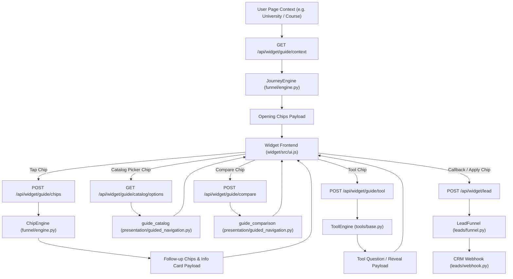

# DegreeBaba Chatbot: Comprehensive System Architecture & Codebase Analysis

This document provides a complete, accurate technical analysis of the **DegreeBaba Guided Admissions Chatbot**. It maps out the directory structure, classes, functions, modules, and API mechanisms of the 100% chip-driven chatbot codebase. Every item is cross-referenced with exact file links on disk.

---

## 1. Directory Structure

The `chatbot` workspace consists of a modular, chip-first guided navigation layout:

```
chatbot/
├── main.py                          # FastAPI server & GuidedWidgetService dependency orchestrator
├── config.py                        # Environment & Pydantic settings configuration
├── schemas.py                       # Request/Response schemas for guided endpoints & cards
├── logging_setup.py                 # Structured logging & session correlation tracing
├── data/                            # Catalog ingestion, envelopes, models & JSON stores
│   ├── accessor.py                  # Catalog node extraction & filtering helpers
│   ├── loader.py                    # Process-wide catalog store & JSON ingestion
│   ├── catalog.sample.json          # Bundle catalog sample dataset
│   ├── chip_map.json                # Versioned chip definition registry
│   ├── flow_map.json                # Surface transition map rules
│   ├── tools_content.json           # Interactive admissions tools manifest
│   └── models/                      # Pydantic entity schema models
│       ├── __init__.py
│       ├── university.py
│       ├── course.py
│       └── specialization.py
├── funnel/                          # Admissions funnel & chip state engine
│   ├── __init__.py
│   ├── chip_config.py               # Chip map validation & thread-safe store
│   ├── flow_config.py               # Flow map rules & transition store
│   └── engine.py                    # JourneyEngine & ChipEngine state machine
├── presentation/                    # UI card builders & guided navigation payload formatters
│   ├── __init__.py
│   ├── cards.py                     # ProgramCard, UniversityCard, ComparisonCard builders
│   ├── chips.py                     # QuickAction array payload adapters
│   ├── formatter.py                 # Catalog string & fact text formatters
│   ├── experience.py                # ResponseContext projection & catalog options finder
│   └── guided_navigation.py         # Grounded page context, comparison & catalog builders
├── tools/                           # Multi-step interactive admissions tools
│   ├── __init__.py
│   ├── base.py                      # ToolEngine & deterministic tool lifecycle
│   ├── content.py                   # Versioned tools content document store
│   ├── roi.py                       # ROI payback calculator logic
│   ├── career_quiz.py               # Weighted career quiz discipline scorer
│   └── scholarship.py               # Fee waiver score band engine
├── session/                         # Session state & navigation step tracking
│   ├── __init__.py
│   ├── state.py                     # ConversationState, Focus, NavigationState models
│   ├── store.py                     # SessionStore (Redis with memory fallback)
│   └── navigation.py                # Navigation steps & surface sync helpers
├── leads/                           # Lead capture & CRM integrations
│   ├── __init__.py
│   ├── funnel.py                    # LeadCaptureFunnel state machine
│   ├── webhook.py                   # CRM webhook emitter with exponential backoff & dead letters
│   └── crm_schema.py                # Lead payload validation models
├── response/                        # Shared catalog fact extractors
│   ├── __init__.py
│   ├── cards.py                     # Text cleaning & catalog entity attributes extraction
│   └── catalog_facts.py             # Categorized catalog facts & accreditation builders
├── widget/                          # Production Web Component & Client Launcher
│   ├── __init__.py
│   ├── config.py                    # Multi-tenant widget site key config store
│   ├── configs.json                 # Tenant branding & bot parameters
│   ├── demo.html                    # Interactive simulator test page
│   ├── widget.css                   # Widget styles (Shadow DOM isolated)
│   ├── widget.js                    # Compiled production bundle
│   ├── build.mjs                    # Bundle compilation script (esbuild)
│   └── src/                         # Modular frontend source scripts
│       ├── actions.js               # Chip click & tool interaction handlers
│       ├── api.js                   # Client HTTP fetch client & payload converters
│       ├── config.js                # Widget configuration loader
│       ├── renderer.js              # Vanilla DOM HTML card renderers
│       ├── state.js                 # Client state manager
│       ├── tools.js                 # Tool widget step renderers
│       └── ui.js                    # Event delegation & main render loop
├── analytics/                       # Event tracking & background emitter
│   ├── __init__.py
│   ├── events.py                    # Schema validation for analytics events
│   └── emitter.py                   # Non-blocking async queue emitter with dead-letter fallback
├── resilience/                      # System health probes
│   ├── __init__.py
│   └── health.py                    # Redis & Catalog dependency health probes
├── scripts/                         # Command-line utility scripts
│   └── validate_flow.py             # Validation script for chip_map.json and flow_map.json
└── docs/                            # Architecture & redesign specifications
    ├── WIDGET_AI_ADVISOR_REDESIGN.md
    └── assets/
```

---

## 2. Architecture & Request Lifecycle

The system operates as a **100% chip-driven, guided admissions assistant**. Users navigate by tapping quick action chips, opening dynamic pickers, comparing programs, or completing interactive tools. There is zero free-text processing or NLU overhead.



---

## 3. Module-by-Module Technical Analysis

### 3.1 Server Core & Service Orchestration

#### [main.py](file:///Users/aryankinha/Documents/Degree/CHAT%20BOT/chatbot/main.py)
* **Purpose**: Core FastAPI application entry point. Coordinates server lifecycle, CORS middleware, route registration, and session dependencies.
* **Key Components**:
  * `GuidedWidgetService` ([main.py:L91](file:///Users/aryankinha/Documents/Degree/CHAT%20BOT/chatbot/main.py#L91)): Central dependency container managing `CatalogStore`, `SessionStore`, `LeadFunnel`, `ChipMapStore`, `JourneyEngine`, `ChipEngine`, `AnalyticsEmitter`, and `ToolEngine`.
  * `lifespan` ([main.py:L367](file:///Users/aryankinha/Documents/Degree/CHAT%20BOT/chatbot/main.py#L367)): Async context manager that initializes settings, pre-loads the catalog, connects Redis, and builds the widget service container.
  * `GET /api/widget/guide/context` ([main.py:L489](file:///Users/aryankinha/Documents/Degree/CHAT%20BOT/chatbot/main.py#L489)): Evaluates page context and returns grounded entity details and opening chips.
  * `POST /api/widget/guide/chips` ([main.py:L572](file:///Users/aryankinha/Documents/Degree/CHAT%20BOT/chatbot/main.py#L572)): Evaluates completed chip actions and calculates follow-up choices via `ChipEngine`.
  * `POST /api/widget/guide/tool` ([main.py:L696](file:///Users/aryankinha/Documents/Degree/CHAT%20BOT/chatbot/main.py#L696)): Dispatches multi-step tool interactions (ROI, Career Quiz, Scholarship).
  * `POST /api/widget/guide/compare` ([main.py:L644](file:///Users/aryankinha/Documents/Degree/CHAT%20BOT/chatbot/main.py#L644)): Serves structured 2-item comparison matrices.
  * `POST /api/widget/lead` ([main.py:L782](file:///Users/aryankinha/Documents/Degree/CHAT%20BOT/chatbot/main.py#L782)): Captures user phone numbers and forwards them to the CRM webhook.
  * `GET /health` ([main.py:L416](file:///Users/aryankinha/Documents/Degree/CHAT%20BOT/chatbot/main.py#L416)): Probes Redis and catalog file readiness.
  * `POST /admin/reindex` ([main.py:L427](file:///Users/aryankinha/Documents/Degree/CHAT%20BOT/chatbot/main.py#L427)): Hot-reloads the catalog store from source URLs or paths.

#### [config.py](file:///Users/aryankinha/Documents/Degree/CHAT%20BOT/chatbot/config.py)
* **Purpose**: Manages application settings via `pydantic-settings`.
* **Key Components**:
  * `Settings` ([config.py:L16](file:///Users/aryankinha/Documents/Degree/CHAT%20BOT/chatbot/config.py#L16)): Parses environment variables for Redis (`redis_url`), catalog paths (`catalog_path`), chip map paths (`chip_map_path`), CRM webhook URLs (`crm_webhook_url`), and CORS settings.

#### [schemas.py](file:///Users/aryankinha/Documents/Degree/CHAT%20BOT/chatbot/schemas.py)
* **Purpose**: Provides type-safe Pydantic request and response schemas for all guided endpoints and rich cards.
* **Key Components**:
  * `GuidedChipRequest`, `GuidedToolRequest`, `WidgetLeadRequest`, `WidgetAnalyticsRequest`.
  * `PageContextResponse`, `CatalogOptionsResponse`, `HealthResponse`.
  * Card models: `UniversityCard`, `ProgramCard`, `ComparisonCard`, `QuickAction`.

#### [logging_setup.py](file:///Users/aryankinha/Documents/Degree/CHAT%20BOT/chatbot/logging_setup.py)
* **Purpose**: Provides structured logging with correlation IDs linking session IDs to individual request turns.

---

### 3.2 Funnel & Chip Engine

#### [funnel/engine.py](file:///Users/aryankinha/Documents/Degree/CHAT%20BOT/chatbot/funnel/engine.py)
* **Purpose**: State machine that calculates chip selections based on context, surface type, and interaction count.
* **Key Components**:
  * `JourneyEngine` ([funnel/engine.py:L157](file:///Users/aryankinha/Documents/Degree/CHAT%20BOT/chatbot/funnel/engine.py#L157)): Resolves opening chips for specific landing surfaces (`homepage`, `university`, `course`, `specialization`).
  * `ChipEngine` ([funnel/engine.py:L218](file:///Users/aryankinha/Documents/Degree/CHAT%20BOT/chatbot/funnel/engine.py#L218)): Calculates follow-up chips after a user taps a chip. Promotes conversion chips (e.g. `cta_callback`) at deeper interaction stages.

#### [funnel/chip_config.py](file:///Users/aryankinha/Documents/Degree/CHAT%20BOT/chatbot/funnel/chip_config.py)
* **Purpose**: Thread-safe configuration store that parses and validates [`data/chip_map.json`](file:///Users/aryankinha/Documents/Degree/CHAT%20BOT/chatbot/data/chip_map.json).

#### [funnel/flow_config.py](file:///Users/aryankinha/Documents/Degree/CHAT%20BOT/chatbot/funnel/flow_config.py)
* **Purpose**: Stores and validates [`data/flow_map.json`](file:///Users/aryankinha/Documents/Degree/CHAT%20BOT/chatbot/data/flow_map.json) flow rules.

---

### 3.3 Interactive Admissions Tools

#### [tools/base.py](file:///Users/aryankinha/Documents/Degree/CHAT%20BOT/chatbot/tools/base.py)
* **Purpose**: Framework governing step-by-step interactive tools (ROI Calculator, Career Quiz, Scholarship Waiver).
* **Key Components**:
  * `ToolEngine` ([tools/base.py:L346](file:///Users/aryankinha/Documents/Degree/CHAT%20BOT/chatbot/tools/base.py#L346)): Manages tool entry, step validation, score calculation, partial reveals, lead gates (`await_lead`), and final unlock states.

#### [tools/roi.py](file:///Users/aryankinha/Documents/Degree/CHAT%20BOT/chatbot/tools/roi.py)
* **Purpose**: Calculates return-on-investment payback months based on program fees and expected salary growth.

#### [tools/career_quiz.py](file:///Users/aryankinha/Documents/Degree/CHAT%20BOT/chatbot/tools/career_quiz.py)
* **Purpose**: Evaluates student preferences to recommend matching discipline courses.

#### [tools/scholarship.py](file:///Users/aryankinha/Documents/Degree/CHAT%20BOT/chatbot/tools/scholarship.py)
* **Purpose**: Calculates fee waiver percentage bands based on quiz performance.

#### [tools/content.py](file:///Users/aryankinha/Documents/Degree/CHAT%20BOT/chatbot/tools/content.py)
* **Purpose**: Thread-safe validator and store for [`data/tools_content.json`](file:///Users/aryankinha/Documents/Degree/CHAT%20BOT/chatbot/data/tools_content.json).

---

### 3.4 Data & Catalog Access Layer

#### [data/loader.py](file:///Users/aryankinha/Documents/Degree/CHAT%20BOT/chatbot/data/loader.py)
* **Purpose**: Loads catalog entities from JSON or remote URLs into a thread-safe `CatalogStore` with $O(1)$ ID and slug lookup.

#### [data/accessor.py](file:///Users/aryankinha/Documents/Degree/CHAT%20BOT/chatbot/data/accessor.py)
* **Purpose**: Safe property extraction utilities (`safe_get`, `first_value`, `clean_text`, `parse_money`) preventing `AttributeError` or `KeyError` on partial publisher data.

#### [data/models/](file:///Users/aryankinha/Documents/Degree/CHAT%20BOT/chatbot/data/models/)
* **Purpose**: Pydantic models for catalog entities (`University`, `Course`, `Specialization`).

---

### 3.5 Presentation & Payload Formatting

#### [presentation/guided_navigation.py](file:///Users/aryankinha/Documents/Degree/CHAT%20BOT/chatbot/presentation/guided_navigation.py)
* **Purpose**: Constructs grounded data bundles for `/api/widget/guide/context`, `/api/widget/guide/catalog/options`, and `/api/widget/guide/compare`.

#### [presentation/cards.py](file:///Users/aryankinha/Documents/Degree/CHAT%20BOT/chatbot/presentation/cards.py)
* **Purpose**: Builds structured card payloads (`ProgramCard`, `UniversityCard`, `ComparisonCard`).

#### [presentation/chips.py](file:///Users/aryankinha/Documents/Degree/CHAT%20BOT/chatbot/presentation/chips.py)
* **Purpose**: Adapts resolved chips into frontend `QuickAction` arrays.

---

### 3.6 Web Widget Frontend (`widget/`)

The widget is written in vanilla JavaScript (compiled via `widget/build.mjs` using `esbuild`) and renders inside a Shadow DOM for CSS isolation.

* **[widget/src/ui.js](file:///Users/aryankinha/Documents/Degree/CHAT%20BOT/chatbot/widget/src/ui.js)**: Main rendering loop and event delegation (chip clicks, overlay escape keys).
* **[widget/src/actions.js](file:///Users/aryankinha/Documents/Degree/CHAT%20BOT/chatbot/widget/src/actions.js)**: Client-side action handlers (`onChip`, `openPicker`, `showInfoCard`, `runGuidedComparison`, `openLeadTurn`, `startTool`).
* **[widget/src/renderer.js](file:///Users/aryankinha/Documents/Degree/CHAT%20BOT/chatbot/widget/src/renderer.js)**: HTML component renderers for cards, chips, reviews, syllabus accordions, and comparison tables.
* **[widget/src/api.js](file:///Users/aryankinha/Documents/Degree/CHAT%20BOT/chatbot/widget/src/api.js)**: Client fetch methods connecting to `/api/widget/guide/*` endpoints.

---

## 4. Summary of Guided Endpoints

| Endpoint | Method | Purpose |
|---|---|---|
| `/api/widget/guide/context` | `GET` | Returns landing page entity details, context chip label, and opening chips. |
| `/api/widget/guide/chips` | `POST` | Processes completed chip tap and returns next follow-up chips and info card payloads. |
| `/api/widget/guide/catalog/options` | `GET` | Serves searchable list options for dynamic pickers (universities, courses). |
| `/api/widget/guide/compare` | `POST` | Serves side-by-side comparison matrix payload for 2 selected entities. |
| `/api/widget/guide/tool` | `POST` | Advances multi-step interactive tools (ROI, Quiz, Scholarship). |
| `/api/widget/lead` | `POST` | Submits phone numbers to CRM webhook and unlocks lead-gated content. |
| `/api/widget/analytics` | `POST` | Ingests client interaction telemetry (`chip_tapped`, `card_shown`, `lead_submitted`). |
| `/health` | `GET` | System health check probing Redis and catalog readiness. |
