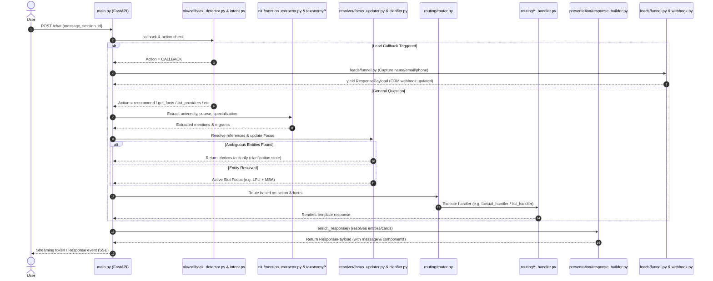

# DegreeBaba Chatbot: Comprehensive System Architecture & Codebase Analysis

This document provides a complete technical analysis of the DegreeBaba Chatbot. It maps out the directories, classes, functions, and communication mechanisms of the codebase. Every item is cross-referenced with exact links to the files on disk, ensuring absolute alignment with the active code.

---

## 1. Directory Structure

The `chatbot` workspace consists of a highly modular, decoupled pipeline layout:

```
chatbot/
├── main.py
├── config.py
├── schemas.py
├── logging_setup.py
├── index.html
├── data/
│   ├── accessor.py
│   ├── loader.py
│   ├── catalog.sample.json
│   └── models/
│       ├── __init__.py
│       ├── university.py
│       ├── course.py
│       └── specialization.py
├── session/
│   ├── state.py
│   └── store.py
├── nlu/
│   ├── action_classifier.py
│   ├── callback_detector.py
│   ├── intent.py
│   └── mention_extractor.py
├── taxonomy/
│   ├── alias_tables.py
│   ├── ambiguity_clusters.py
│   ├── category_index.py
│   ├── entity_matcher.py
│   ├── fuzzy_bucket.py
│   ├── index_builder.py
│   └── ngram_matcher.py
├── resolver/
│   ├── reference_resolver.py
│   ├── focus_updater.py
│   ├── clarifier.py
│   └── pending_clarification.py
├── routing/
│   ├── router.py
│   ├── factual_handler.py
│   ├── category_handler.py
│   ├── clarification_handler.py
│   ├── comparison_handler.py
│   ├── discovery_handler.py
│   ├── advisory_handler.py
│   ├── list_handler.py
│   ├── knowledge_handler.py
│   ├── unsupported_handler.py
│   ├── validation_handler.py
│   └── fallback_handler.py
├── response/
│   ├── builder.py
│   ├── cta.py
│   ├── cards.py
│   └── templates.py
├── presentation/
│   ├── __init__.py
│   ├── cards.py
│   ├── formatter.py
│   └── response_builder.py
├── widget/
│   ├── __init__.py
│   ├── config.py
│   ├── configs.json
│   ├── demo.html
│   ├── widget.css
│   └── widget.js
├── leads/
│   ├── funnel.py
│   ├── webhook.py
│   └── crm_schema.py
├── llm/
│   ├── client.py
│   └── prompts.py
└── resilience/
    ├── health.py
    └── intent_metrics.py
```

---

## 2. Request Lifecycle & Architecture Flow

The request lifecycle is split into deterministic matching, LLM classification, slot resolution, routing, and presentation enrichment:



---

## 3. Module-by-Module Code Analysis

### 3.1 Root Level Configuration & Service Entry

#### [main.py](file:///Users/aryankinha/Documents/Degree/CHAT%20BOT/chatbot/main.py)
*   **Purpose**: Main API endpoint entry point using FastAPI. Coordinates HTTP server startup, connection checks, session persistence hookups, chat payload streaming, and diagnostic metric routes.
*   **Key Components**:
    *   `lifespan` ([main.py:L40-79](file:///Users/aryankinha/Documents/Degree/CHAT%20BOT/chatbot/main.py#L40-L79)): Async context manager that initializes settings, database models, LLM clients, session store connection pools, catalog loaders, and precompiles taxonomy indexes.
    *   `ChatbotService` ([main.py:L82-358](file:///Users/aryankinha/Documents/Degree/CHAT%20BOT/chatbot/main.py#L82-L358)): Central workflow orchestrator. Combines session loading, NLU detection, action classification, taxonomy slots matching, context updating, and routes dispatching.
    *   `POST /chat` ([main.py:L397-425](file:///Users/aryankinha/Documents/Degree/CHAT%20BOT/chatbot/main.py#L397-L425)): Accepts a `ChatRequest` and streams a `StreamingResponse` using Server-Sent Events (SSE).
    *   `GET /health` ([main.py:L427-431](file:///Users/aryankinha/Documents/Degree/CHAT%20BOT/chatbot/main.py#L427-L431)): Probes external databases, cache servers, and LLM integrations.
    *   `GET /metrics` ([main.py:L865-868](file:///Users/aryankinha/Documents/Degree/CHAT%20BOT/chatbot/main.py#L865-L868)): Exposes a JSON snapshot of intent classification volumes, latencies, and fallback sources.
    *   `POST /admin/metrics/reset` ([main.py:L871-882](file:///Users/aryankinha/Documents/Degree/CHAT%20BOT/chatbot/main.py#L871-L882)): Authorizes an administrator to clear metric epochs.
    *   `POST /admin/reindex` ([main.py:L433-456](file:///Users/aryankinha/Documents/Degree/CHAT%20BOT/chatbot/main.py#L433-L456)): Re-downloads the catalog database and rebuilds the search indices in background memory.
*   **Core Imports**: `fastapi`, `pydantic`, `sse_starlette`, `config`, `logging_setup`, `session.store`, `data.loader`, `nlu.mention_extractor`, `taxonomy.entity_matcher`, `resolver.focus_updater`, `routing.router`, `resilience.health`, `resilience.intent_metrics`.

#### [config.py](file:///Users/aryankinha/Documents/Degree/CHAT%20BOT/chatbot/config.py)
*   **Purpose**: Manages configuration parsing via `pydantic-settings`.
*   **Key Components**:
    *   `Settings` ([config.py:L16-43](file:///Users/aryankinha/Documents/Degree/CHAT%20BOT/chatbot/config.py#L16-L43)): Loads variables from `.env` with fallback defaults. Includes connection credentials for Redis, Groq, OpenAI, Gemini model targets (`gemini_model`, `gemini_intent_timeout_ms`), catalog files, and webhook parameters.
*   **Core Imports**: `pydantic_settings.BaseSettings`, `pydantic.Field`.

#### [schemas.py](file:///Users/aryankinha/Documents/Degree/CHAT%20BOT/chatbot/schemas.py)
*   **Purpose**: Hosts the structure schemas for payloads returned by HTTP endpoints.
*   **Key Components**:
    *   `ChatRequest` ([schemas.py:L19-24](file:///Users/aryankinha/Documents/Degree/CHAT%20BOT/chatbot/schemas.py#L19-L24)): Schema for message requests.
    *   `CtaPayload` ([schemas.py:L27-31](file:///Users/aryankinha/Documents/Degree/CHAT%20BOT/chatbot/schemas.py#L27-L31)): Call to Action detail payload structure (includes target action, titles, and link URIs).
    *   `ResponsePayload` ([schemas.py:L34-40](file:///Users/aryankinha/Documents/Degree/CHAT%20BOT/chatbot/schemas.py#L34-L40)): Response returned by standard chatbot routes.
*   **Core Imports**: `pydantic.BaseModel`.

#### [logging_setup.py](file:///Users/aryankinha/Documents/Degree/CHAT%20BOT/chatbot/logging_setup.py)
*   **Purpose**: Centralizes turn trace outputs. Assigns unique session correlation IDs.
*   **Key Components**:
    *   `LOGGERS` ([logging_setup.py:L17-24](file:///Users/aryankinha/Documents/Degree/CHAT%20BOT/chatbot/logging_setup.py#L17-L24)): Dict of independent loggers mapped to application components.
    *   `correlation_id` ([logging_setup.py:L27-31](file:///Users/aryankinha/Documents/Degree/CHAT%20BOT/chatbot/logging_setup.py#L27-L31)): Combines transaction turn counts with the tail of the session ID.
    *   `TurnLogger` ([logging_setup.py:L83-100](file:///Users/aryankinha/Documents/Degree/CHAT%20BOT/chatbot/logging_setup.py#L83-L100)): Inserts correlation context to standard log handlers.
*   **Core Imports**: `logging`, `json`, `sys`.

---

### 3.2 Session Layer

#### [session/state.py](file:///Users/aryankinha/Documents/Degree/CHAT%20BOT/chatbot/session/state.py)
*   **Purpose**: Structure schemas representing the conversation state of active users.
*   **Key Components**:
    *   `Focus` ([session/state.py:L13-22](file:///Users/aryankinha/Documents/Degree/CHAT%20BOT/chatbot/session/state.py#L13-L22)): Active topic model containing the resolved slots (e.g. `university_id`, `category`, `specialization_id`).
    *   `PendingClarification` ([session/state.py:L25-33](file:///Users/aryankinha/Documents/Degree/CHAT%20BOT/chatbot/session/state.py#L25-L33)): Stores options to present during a clarification flow.
    *   `LeadFunnelState` ([session/state.py:L36-37](file:///Users/aryankinha/Documents/Degree/CHAT%20BOT/chatbot/session/state.py#L36-L37)): Contact extraction state tracks name, email, and phone collection.
    *   `ConversationState` ([session/state.py:L40-58](file:///Users/aryankinha/Documents/Degree/CHAT%20BOT/chatbot/session/state.py#L40-L58)): Full state object holding the session history, active focus, lead details, turn counter, and conversation context.
*   **Core Imports**: `pydantic.BaseModel`, `session.state.Focus`, `session.state.PendingClarification`.

#### [session/store.py](file:///Users/aryankinha/Documents/Degree/CHAT%20BOT/chatbot/session/store.py)
*   **Purpose**: Manages persisting, updating, and expiring conversation states using Redis or local memory.
*   **Key Components**:
    *   `SessionStore` ([session/store.py:L19-106](file:///Users/aryankinha/Documents/Degree/CHAT%20BOT/chatbot/session/store.py#L19-L106)): Implements get, set, delete, and health check actions. Falls back to a local memory cache if Redis is down.
*   **Core Imports**: `redis.asyncio`, `json`, `session.state.ConversationState`.

---

### 3.3 Catalog Data Ingestion & Models

#### [data/loader.py](file:///Users/aryankinha/Documents/Degree/CHAT%20BOT/chatbot/data/loader.py)
*   **Purpose**: Ingests, parses, and caches data records from local JSON files or remote URLs.
*   **Key Components**:
    *   `CatalogStore` ([data/loader.py:L113-195](file:///Users/aryankinha/Documents/Degree/CHAT%20BOT/chatbot/data/loader.py#L113-L195)): Connects, fetches, parses envelopes via `parse_entity`, updates memory stores, and compiles the taxonomy indices.
*   **Core Imports**: `httpx`, `pydantic`, `data.models.parse_entity`, `taxonomy.index_builder.build_indexes`.

#### [data/accessor.py](file:///Users/aryankinha/Documents/Degree/CHAT%20BOT/chatbot/data/accessor.py)
*   **Purpose**: Utility library providing helper utilities to parse catalog nodes.
*   **Key Components**:
    *   `CatalogAccessor` ([data/accessor.py:L16-177](file:///Users/aryankinha/Documents/Degree/CHAT%20BOT/chatbot/data/accessor.py#L16-L177)): Fast search utilities (e.g. finding courses by university, listing specializations, checking UGC status, NAAC grade, or retrieving lists of categories).
*   **Core Imports**: `data.models.university`, `data.models.course`, `data.models.specialization`.

#### [data/models/__init__.py](file:///Users/aryankinha/Documents/Degree/CHAT%20BOT/chatbot/data/models/__init__.py)
*   **Purpose**: Entrypoint for Pydantic document parsing.
*   **Key Components**:
    *   `parse_entity` ([data/models/__init__.py:L61-91](file:///Users/aryankinha/Documents/Degree/CHAT%20BOT/chatbot/data/models/__init__.py#L61-L91)): Inspects the envelope `_meta.page_type` and instantiates the correct model.
*   **Core Imports**: `data.models.university.University`, `data.models.course.Course`, `data.models.specialization.Specialization`.

#### [data/models/university.py](file:///Users/aryankinha/Documents/Degree/CHAT%20BOT/chatbot/data/models/university.py)
*   **Purpose**: Defines the structure for university documents.
*   **Key Components**:
    *   `University` ([data/models/university.py:L57-105](file:///Users/aryankinha/Documents/Degree/CHAT%20BOT/chatbot/data/models/university.py#L57-L105)): Validates fields like accreditation logs, faculty boards, program listings (`programs_table`), NAAC grade, learning mode, and FAQs.
*   **Core Imports**: `pydantic.BaseModel`.

#### [data/models/course.py](file:///Users/aryankinha/Documents/Degree/CHAT%20BOT/chatbot/data/models/course.py)
*   **Purpose**: Defines the structure for course family pages.
*   **Key Components**:
    *   `Course` ([data/models/course.py:L34-85](file:///Users/aryankinha/Documents/Degree/CHAT%20BOT/chatbot/data/models/course.py#L34-L85)): Validates fee plans, career paths, syllabus guides, duration, and eligibility criteria.
*   **Core Imports**: `pydantic.BaseModel`, `data.models.university.PublisherModel`.

#### [data/models/specialization.py](file:///Users/aryankinha/Documents/Degree/CHAT%20BOT/chatbot/data/models/specialization.py)
*   **Purpose**: Defines the structure for specialization programs.
*   **Key Components**:
    *   `Specialization` ([data/models/specialization.py:L24-74](file:///Users/aryankinha/Documents/Degree/CHAT%20BOT/chatbot/data/models/specialization.py#L24-L74)): Validates specialization facts, syllabus info, placement figures, and associated courses.
*   **Core Imports**: `pydantic.BaseModel`, `data.models.course.Highlight`.

---

### 3.4 Natural Language Understanding (NLU)

#### [nlu/callback_detector.py](file:///Users/aryankinha/Documents/Degree/CHAT%20BOT/chatbot/nlu/callback_detector.py)
*   **Purpose**: Detects requests to speak with a human or request a callback. Always runs before the LLM router to minimize API overhead.
*   **Key Components**:
    *   `_fuzzy_human_match` ([nlu/callback_detector.py:L69-75](file:///Users/aryankinha/Documents/Degree/CHAT%20BOT/chatbot/nlu/callback_detector.py#L69-L75)): Employs RapidFuzz token matching to catch spelling errors (e.g. `concellor`, `counsular`).
    *   `is_callback_request` ([nlu/callback_detector.py:L78-93](file:///Users/aryankinha/Documents/Degree/CHAT%20BOT/chatbot/nlu/callback_detector.py#L78-L93)): Checks regex rules and fuzzy verbs (e.g. `talk counselor`, `request callback`).
*   **Core Imports**: `re`, `rapidfuzz.fuzz`.

#### [nlu/action_classifier.py](file:///Users/aryankinha/Documents/Degree/CHAT%20BOT/chatbot/nlu/action_classifier.py)
*   **Purpose**: Pure action selector that operates over resolved catalog mentions and bounded regex phrase markers to bypass LLM requests.
*   **Key Components**:
    *   `Action` ([nlu/action_classifier.py:L10-24](file:///Users/aryankinha/Documents/Degree/CHAT%20BOT/chatbot/nlu/action_classifier.py#L10-L24)): StrEnum defining query actions (e.g. `GET_FACTS`, `LIST_SPECIALIZATIONS`, `LIST_PROVIDERS`, `COMPARE`, `RECOMMEND`, `CALLBACK`, `UNSUPPORTED_ENTITY`).
    *   `classify` ([nlu/action_classifier.py:L94-136](file:///Users/aryankinha/Documents/Degree/CHAT%20BOT/chatbot/nlu/action_classifier.py#L94-L136)): Inspects candidate lists. Returns a deterministic Action or `None` if the input must be escalated to Gemini.
    *   `mention_summary` ([nlu/action_classifier.py:L139-165](file:///Users/aryankinha/Documents/Degree/CHAT%20BOT/chatbot/nlu/action_classifier.py#L139-L165)): Helper that formats resolved names to send to Gemini prompts.
*   **Core Imports**: `re`, `enum.StrEnum`.

#### [nlu/intent.py](file:///Users/aryankinha/Documents/Degree/CHAT%20BOT/chatbot/nlu/intent.py)
*   **Purpose**: Classifies user messages into intents using Gemini when local heuristic rules do not apply.
*   **Key Components**:
    *   `decide_action` ([nlu/intent.py:L116-169](file:///Users/aryankinha/Documents/Degree/CHAT%20BOT/chatbot/nlu/intent.py#L116-L169)): Evaluates the message by sending a strict JSON-Schema content request to the Gemini API via `llm.decide_action_tiny`. Automatically handles fallback intent mapping if the API is offline.
*   **Core Imports**: `dataclasses.dataclass`, `llm.client`, `nlu.action_classifier.Action`.

#### [nlu/mention_extractor.py](file:///Users/aryankinha/Documents/Degree/CHAT%20BOT/chatbot/nlu/mention_extractor.py)
*   **Purpose**: Tokenizes queries and extracts slots for catalog matching.
*   **Key Components**:
    *   `extract_mentions` ([nlu/mention_extractor.py:L65-102](file:///Users/aryankinha/Documents/Degree/CHAT%20BOT/chatbot/nlu/mention_extractor.py#L65-L102)): Identifies direct university, course, and specialization candidates using the [EntityMatcher](file:///Users/aryankinha/Documents/Degree/CHAT%20BOT/chatbot/taxonomy/entity_matcher.py#L37). Exposes confidence check helper indicators (`has_high_confidence_mention`, `has_medium_confidence_mention`).
*   **Core Imports**: `taxonomy.entity_matcher.resolve_slot`.

---

### 3.5 Taxonomy & Matching Engine

#### [taxonomy/alias_tables.py](file:///Users/aryankinha/Documents/Degree/CHAT%20BOT/chatbot/taxonomy/alias_tables.py)
*   **Purpose**: Curated list of exact keyword aliases (e.g., `lpu` $\rightarrow$ Lovely Professional University, `hr` $\rightarrow$ Human Resources) to override fuzzy taxonomy matching.
*   **Key Components**:
    *   `normalize_text` ([taxonomy/alias_tables.py:L17-25](file:///Users/aryankinha/Documents/Degree/CHAT%20BOT/chatbot/taxonomy/alias_tables.py#L17-L25)): Normalizes text by removing accents, convert to lowercase, and replacing `&` with `and`.
    *   `CURATED_ALIASES` ([taxonomy/alias_tables.py:L30-45](file:///Users/aryankinha/Documents/Degree/CHAT%20BOT/chatbot/taxonomy/alias_tables.py#L30-L45)): The static override mapping.
*   **Core Imports**: `unicodedata`, `re`.

#### [taxonomy/ambiguity_clusters.py](file:///Users/aryankinha/Documents/Degree/CHAT%20BOT/chatbot/taxonomy/ambiguity_clusters.py)
*   **Purpose**: Group and handle ambiguous terms that map to multiple entities (e.g., "Jain" mapping to different Jain University entries).
*   **Key Components**:
    *   `build_ambiguity_clusters` ([taxonomy/ambiguity_clusters.py:L15-54](file:///Users/aryankinha/Documents/Degree/CHAT%20BOT/chatbot/taxonomy/ambiguity_clusters.py#L15-L54)): Detects duplicate abbreviations or shared words across entities to flag them as ambiguous.
*   **Core Imports**: `collections.defaultdict`, `taxonomy.alias_tables.normalize_text`.

#### [taxonomy/category_index.py](file:///Users/aryankinha/Documents/Degree/CHAT%20BOT/chatbot/taxonomy/category_index.py)
*   **Purpose**: Reverses catalog indexes to query entity lists by category, university, or specialization.
*   **Key Components**:
    *   `CategoryIndex` ([taxonomy/category_index.py:L18-143](file:///Users/aryankinha/Documents/Degree/CHAT%20BOT/chatbot/taxonomy/category_index.py#L18-L143)): Tracks entity-category links and provides search intersections.
*   **Core Imports**: `dataclasses.dataclass`.

#### [taxonomy/entity_matcher.py](file:///Users/aryankinha/Documents/Degree/CHAT%20BOT/chatbot/taxonomy/entity_matcher.py)
*   **Purpose**: Resolves entity candidate tokens.
*   **Key Components**:
    *   `EntityMatcher` ([taxonomy/entity_matcher.py:L37-74](file:///Users/aryankinha/Documents/Degree/CHAT%20BOT/chatbot/taxonomy/entity_matcher.py#L37-L74)): Resolves matches and queries ambiguity clusters to determine confidence levels.
*   **Core Imports**: `taxonomy.index_builder.build_indexes`, `taxonomy.ngram_matcher.match_ngrams`.

#### [taxonomy/fuzzy_bucket.py](file:///Users/aryankinha/Documents/Degree/CHAT%20BOT/chatbot/taxonomy/fuzzy_bucket.py)
*   **Purpose**: Organizes entities into search buckets to optimize fuzzy spelling match lookups.
*   **Key Components**:
    *   `pragmatic_score` ([taxonomy/fuzzy_bucket.py:L47-82](file:///Users/aryankinha/Documents/Degree/CHAT%20BOT/chatbot/taxonomy/fuzzy_bucket.py#L47-L82)): Custom scoring logic. Uses token sort ratio and transposition checks to catch short acronym typos (e.g. `mabb` $\rightarrow$ `mba`).
*   **Core Imports**: `rapidfuzz.fuzz`, `taxonomy.alias_tables.normalize_text`.

#### [taxonomy/index_builder.py](file:///Users/aryankinha/Documents/Degree/CHAT%20BOT/chatbot/taxonomy/index_builder.py)
*   **Purpose**: Compiles catalog entities into immutable in-memory search indices on startup.
*   **Key Components**:
    *   `build_indexes` ([taxonomy/index_builder.py:L265-467](file:///Users/aryankinha/Documents/Degree/CHAT%20BOT/chatbot/taxonomy/index_builder.py#L265-L467)): Parses names, aliases, and categories to compile n-gram maps, acronym listings, and frequency tables.
*   **Core Imports**: `taxonomy.alias_tables.normalize_text`, `taxonomy.category_index.CategoryIndex`.

#### [taxonomy/ngram_matcher.py](file:///Users/aryankinha/Documents/Degree/CHAT%20BOT/chatbot/taxonomy/ngram_matcher.py)
*   **Purpose**: Iterates over tokens longest-span-first to identify entity candidate matches.
*   **Key Components**:
    *   `match_ngrams` ([taxonomy/ngram_matcher.py:L74-135](file:///Users/aryankinha/Documents/Degree/CHAT%20BOT/chatbot/taxonomy/ngram_matcher.py#L74-L135)): Looks up matches sequentially: exact match aliases (Layer 1) $\rightarrow$ acronyms (Layer 2) $\rightarrow$ ngrams (Layer 3) $\rightarrow$ spelling corrections via fuzzy bucket search (Layer 4).
*   **Core Imports**: `taxonomy.fuzzy_bucket.search_bucket`.

---

### 3.6 Resolution & Disambiguation

#### [resolver/reference_resolver.py](file:///Users/aryankinha/Documents/Degree/CHAT%20BOT/chatbot/resolver/reference_resolver.py)
*   **Purpose**: Resolves pronoun references (e.g. `it`, `this program`) to the active entity in context.
*   **Key Components**:
    *   `resolve_references` ([resolver/reference_resolver.py:L14-38](file:///Users/aryankinha/Documents/Degree/CHAT%20BOT/chatbot/resolver/reference_resolver.py#L14-L38)): Injects active entity IDs into the extraction state when a pronoun match is detected.
*   **Core Imports**: `session.state.Focus`.

#### [resolver/focus_updater.py](file:///Users/aryankinha/Documents/Degree/CHAT%20BOT/chatbot/resolver/focus_updater.py)
*   **Purpose**: Updates the session's active focus slots based on the extracted entities.
*   **Key Components**:
    *   `FocusUpdater` ([resolver/focus_updater.py:L140-272](file:///Users/aryankinha/Documents/Degree/CHAT%20BOT/chatbot/resolver/focus_updater.py#L140-L272)): Intersects candidate slots to resolve to a specific catalog ID. If a user changes to a new university, the updater resets the deeper slots (courses/specializations) to prevent stale focus states.
*   **Core Imports**: `session.state.Focus`, `data.accessor.CatalogAccessor`.

#### [resolver/clarifier.py](file:///Users/aryankinha/Documents/Degree/CHAT%20BOT/chatbot/resolver/clarifier.py)
*   **Purpose**: Triggers clarification questions when an extraction maps to multiple candidates.
*   **Key Components**:
    *   `resolve_focus_or_clarify` ([resolver/clarifier.py:L76-121](file:///Users/aryankinha/Documents/Degree/CHAT%20BOT/chatbot/resolver/clarifier.py#L76-L121)): Checks if a slot maps to multiple entities. If so, it flags a `PendingClarification` and asks the user to select the correct choice.
*   **Core Imports**: `session.state.PendingClarification`.

#### [resolver/pending_clarification.py](file:///Users/aryankinha/Documents/Degree/CHAT%20BOT/chatbot/resolver/pending_clarification.py)
*   **Purpose**: Resolves the user's response to an outstanding clarification question.
*   **Key Components**:
    *   `resolve_pending_clarification` ([resolver/pending_clarification.py:L194-279](file:///Users/aryankinha/Documents/Degree/CHAT%20BOT/chatbot/resolver/pending_clarification.py#L194-L279)): Inspects the message for ordinals ("the first one", "2nd"), yes/no options, or names matching the clarification choices.
*   **Core Imports**: `session.state.ConversationState`.

---

### 3.7 Routing & Dialog Handlers

#### [routing/router.py](file:///Users/aryankinha/Documents/Degree/CHAT%20BOT/chatbot/routing/router.py)
*   **Purpose**: Routes user inputs to the correct dialog handler based on action and active focus.
*   **Key Components**:
    *   `select_route` ([routing/router.py:L73-117](file:///Users/aryankinha/Documents/Degree/CHAT%20BOT/chatbot/routing/router.py#L73-L117)): Directs active state contexts to RouteNames (`list_specializations`, `list_providers`, `advisory`, `comparison`, `factual`, `knowledge`, `fallback`, `clarification`).
    *   `dispatch_route` ([routing/router.py:L134-208](file:///Users/aryankinha/Documents/Degree/CHAT%20BOT/chatbot/routing/router.py#L134-L208)): Runs the matched handler, supplying extracted mentions and category parameters.
*   **Core Imports**: `routing.factual_handler`, `routing.advisory_handler`, `routing.list_handler`, `routing.comparison_handler`.

#### [routing/list_handler.py](file:///Users/aryankinha/Documents/Degree/CHAT%20BOT/chatbot/routing/list_handler.py)
*   **Purpose**: Handles queries asking for lists of specializations or providers.
*   **Key Components**:
    *   `handle_list_specializations` ([routing/list_handler.py:L27-65](file:///Users/aryankinha/Documents/Degree/CHAT%20BOT/chatbot/routing/list_handler.py#L27-L65)): Renders a sorted list of specializations offering within a category.
    *   `handle_list_providers` ([routing/list_handler.py:L68-113](file:///Users/aryankinha/Documents/Degree/CHAT%20BOT/chatbot/routing/list_handler.py#L68-L113)): Compiles all university providers that offer a resolved specialization.
*   **Core Imports**: `data.accessor.safe_get`, `response.builder.build_response`, `response.cards.catalog_get_entity`.

#### [routing/factual_handler.py](file:///Users/aryankinha/Documents/Degree/CHAT%20BOT/chatbot/routing/factual_handler.py)
*   **Purpose**: Handles queries asking for details on specific courses, universities, or specializations.
*   **Key Components**:
    *   `handle_factual` ([routing/factual_handler.py:L142-209](file:///Users/aryankinha/Documents/Degree/CHAT%20BOT/chatbot/routing/factual_handler.py#L142-L209)): Formats answers using predefined templates from [templates.py](file:///Users/aryankinha/Documents/Degree/CHAT%20BOT/chatbot/response/templates.py) or uses the LLM synthesis pipeline if templates do not cover the requested attribute.
*   **Core Imports**: `response.builder.build_response`, `response.templates.lookup_attribute`.

#### [routing/category_handler.py](file:///Users/aryankinha/Documents/Degree/CHAT%20BOT/chatbot/routing/category_handler.py)
*   **Purpose**: Summarizes courses at the category level (e.g. listing all universities that offer an MBA and their pricing ranges).
*   **Key Components**:
    *   `handle_category` ([routing/category_handler.py:L70-137](file:///Users/aryankinha/Documents/Degree/CHAT%20BOT/chatbot/routing/category_handler.py#L70-L137)): Computes aggregate details for a category, such as min/max fees and a list of providing universities.
*   **Core Imports**: `response.builder.build_response`, `taxonomy.alias_tables.normalize_text`.

#### [routing/clarification_handler.py](file:///Users/aryankinha/Documents/Degree/CHAT%20BOT/chatbot/routing/clarification_handler.py)
*   **Purpose**: Asks clarification questions to disambiguate slot matches.
*   **Key Components**:
    *   `handle_clarification` ([routing/clarification_handler.py:L11-29](file:///Users/aryankinha/Documents/Degree/CHAT%20BOT/chatbot/routing/clarification_handler.py#L11-L29)): Formats choices into a numbered list and renders selection chips.
*   **Core Imports**: `response.builder.build_response`.

#### [routing/comparison_handler.py](file:///Users/aryankinha/Documents/Degree/CHAT%20BOT/chatbot/routing/comparison_handler.py)
*   **Purpose**: Compares course categories side-by-side (e.g. MBA vs MCA).
*   **Key Components**:
    *   `handle_comparison` ([routing/comparison_handler.py:L44-102](file:///Users/aryankinha/Documents/Degree/CHAT%20BOT/chatbot/routing/comparison_handler.py#L44-L102)): Compares student fees and options across selected categories. Honors advisory ranking redirections when no explicit operand targets are provided.
*   **Core Imports**: `response.builder.build_response`, `routing.advisory_handler.advisory_preference`.

#### [routing/discovery_handler.py](file:///Users/aryankinha/Documents/Degree/CHAT%20BOT/chatbot/routing/discovery_handler.py)
*   **Purpose**: Welcome flow for new users.
*   **Key Components**:
    *   `handle_discovery` ([routing/discovery_handler.py:L13-37](file:///Users/aryankinha/Documents/Degree/CHAT%20BOT/chatbot/routing/discovery_handler.py#L13-L37)): Renders standard category options as suggested chips.
*   **Core Imports**: `response.builder.build_response`.

#### [routing/advisory_handler.py](file:///Users/aryankinha/Documents/Degree/CHAT%20BOT/chatbot/routing/advisory_handler.py)
*   **Purpose**: Guides users looking for course or university suggestions based on budget or career goals.
*   **Key Components**:
    *   `handle_advisory` ([routing/advisory_handler.py:L12-32](file:///Users/aryankinha/Documents/Degree/CHAT%20BOT/chatbot/routing/advisory_handler.py#L12-L32)): Uses the LLM to parse goals and recommend relevant options from the catalog.
*   **Core Imports**: `llm.client`, `response.builder.build_response`.

#### [routing/knowledge_handler.py](file:///Users/aryankinha/Documents/Degree/CHAT%20BOT/chatbot/routing/knowledge_handler.py)
*   **Purpose**: Answers general questions about higher education concepts (e.g. NAAC grades, UGC approvals).
*   **Key Components**:
    *   `handle_knowledge` ([routing/knowledge_handler.py:L11-26](file:///Users/aryankinha/Documents/Degree/CHAT%20BOT/chatbot/routing/knowledge_handler.py#L11-L26)): Maps educational query terms to predefined answers.
*   **Core Imports**: `response.builder.build_response`.

#### [routing/unsupported_handler.py](file:///Users/aryankinha/Documents/Degree/CHAT%20BOT/chatbot/routing/unsupported_handler.py)
*   **Purpose**: Handles references to entities/names that are recognized but absent from the published catalog.
*   **Key Components**:
    *   `handle_unsupported_entity` ([routing/unsupported_handler.py:L24-62](file:///Users/aryankinha/Documents/Degree/CHAT%20BOT/chatbot/routing/unsupported_handler.py#L24-L62)): Returns a polite response indicating that the specific entity was not found, while listing active providers within the requested course category to guide the user back into catalog scope.
*   **Core Imports**: `response.builder.build_response`, `routing.category_handler.category_summary`.

#### [routing/validation_handler.py](file:///Users/aryankinha/Documents/Degree/CHAT%20BOT/chatbot/routing/validation_handler.py)
*   **Purpose**: Handles valid entities that cannot form a valid published program/university combination.
*   **Key Components**:
    *   `handle_invalid_combination` ([routing/validation_handler.py:L13-46](file:///Users/aryankinha/Documents/Degree/CHAT%20BOT/chatbot/routing/validation_handler.py#L13-L46)): Identifies conflict states (e.g. university X not offering course Y) and returns alternative universities offering that category.
*   **Core Imports**: `response.builder.build_response`, `routing.category_handler.category_summary`.

#### [routing/fallback_handler.py](file:///Users/aryankinha/Documents/Degree/CHAT%20BOT/chatbot/routing/fallback_handler.py)
*   **Purpose**: General recovery flow when query intent cannot be resolved.
*   **Key Components**:
    *   `handle_fallback` ([routing/fallback_handler.py:L15-37](file:///Users/aryankinha/Documents/Degree/CHAT%20BOT/chatbot/routing/fallback_handler.py#L15-L37)): Prompts the user with fallback suggestions and options to talk to a counselor.
*   **Core Imports**: `response.builder.build_response`.

---

### 3.8 Response Formatting

#### [response/builder.py](file:///Users/aryankinha/Documents/Degree/CHAT%20BOT/chatbot/response/builder.py)
*   **Purpose**: Standardizes the JSON payload responses returned by routers.
*   **Key Components**:
    *   `build_response` ([response/builder.py:L12-36](file:///Users/aryankinha/Documents/Degree/CHAT%20BOT/chatbot/response/builder.py#L12-L36)): Constructs a standardized [ResponsePayload](file:///Users/aryankinha/Documents/Degree/CHAT%20BOT/chatbot/schemas.py#L34) structure.
*   **Core Imports**: `schemas.ResponsePayload`.

#### [response/cta.py](file:///Users/aryankinha/Documents/Degree/CHAT%20BOT/chatbot/response/cta.py)
*   **Purpose**: Standardizes target parameters for Call to Action buttons (e.g., opening admission links or lead captures).
*   **Key Components**:
    *   `build_cta` ([response/cta.py:L11-27](file:///Users/aryankinha/Documents/Degree/CHAT%20BOT/chatbot/response/cta.py#L11-L27)): Constructs a standardized `CtaPayload` structure.
*   **Core Imports**: `schemas.CtaPayload`.

#### [response/cards.py](file:///Users/aryankinha/Documents/Degree/CHAT%20BOT/chatbot/response/cards.py)
*   **Purpose**: Utility functions to format numbers, clean text, and strip HTML tags.
*   **Key Components**:
    *   `format_inr` ([response/cards.py:L12-19](file:///Users/aryankinha/Documents/Degree/CHAT%20BOT/chatbot/response/cards.py#L12-L19)): Formats numbers into currency format (e.g. `INR 1,50,000`).
    *   `strip_html` ([response/cards.py:L22-26](file:///Users/aryankinha/Documents/Degree/CHAT%20BOT/chatbot/response/cards.py#L22-L26)): Strips HTML tags using regex patterns.
*   **Core Imports**: `re`.

#### [response/templates.py](file:///Users/aryankinha/Documents/Degree/CHAT%20BOT/chatbot/response/templates.py)
*   **Purpose**: Stores pre-written templates for factual responses.
*   **Key Components**:
    *   `lookup_attribute` ([response/templates.py:L164-219](file:///Users/aryankinha/Documents/Degree/CHAT%20BOT/chatbot/response/templates.py#L164-L219)): Maps specific topics (e.g. UGC approvals, NAAC grades) to structured response templates, populating them with the resolved entity's details.
*   **Core Imports**: `data.models.university`, `data.models.course`, `data.models.specialization`.

---

### 3.9 Lead Capture & CRM Integrations

#### [leads/funnel.py](file:///Users/aryankinha/Documents/Degree/CHAT%20BOT/chatbot/leads/funnel.py)
*   **Purpose**: Manages progressive contact capture (name, email, phone) within a chat session.
*   **Key Components**:
    *   `LeadCaptureFunnel` ([leads/funnel.py:L55-151](file:///Users/aryankinha/Documents/Degree/CHAT%20BOT/chatbot/leads/funnel.py#L55-L151)): Extracts contact details from user messages. Stores them in the session state, prompting for any missing fields. Triggered webhooks are sent to the CRM using [webhook.py](file:///Users/aryankinha/Documents/Degree/CHAT%20BOT/chatbot/leads/webhook.py).
*   **Core Imports**: `re`, `session.state.LeadFunnelState`, `leads.webhook.send_lead`.

#### [leads/webhook.py](file:///Users/aryankinha/Documents/Degree/CHAT%20BOT/chatbot/leads/webhook.py)
*   **Purpose**: Sends captured lead records to a CRM webhook.
*   **Key Components**:
    *   `send_lead` ([leads/webhook.py:L19-59](file:///Users/aryankinha/Documents/Degree/CHAT%20BOT/chatbot/leads/webhook.py#L19-L59)): Async call with exponential backoff retries using `tenacity`.
    *   `write_dead_letter` ([leads/webhook.py:L62-72](file:///Users/aryankinha/Documents/Degree/CHAT%20BOT/chatbot/leads/webhook.py#L62-L72)): Logs failed leads to a local file (`var/lead_dead_letters.jsonl`) if the CRM webhook fails after 3 retry attempts.
*   **Core Imports**: `httpx`, `tenacity`.

#### [leads/crm_schema.py](file:///Users/aryankinha/Documents/Degree/CHAT%20BOT/chatbot/leads/crm_schema.py)
*   **Purpose**: Defines the structure for CRM data models.
*   **Key Components**:
    *   `CRMLeadEnvelope` ([leads/crm_schema.py:L9-18](file:///Users/aryankinha/Documents/Degree/CHAT%20BOT/chatbot/leads/crm_schema.py#L9-L18)): Model schema validating names, emails, phones, and session parameters.
*   **Core Imports**: `pydantic.BaseModel`.

---

### 3.10 LLM Integrations

#### [llm/client.py](file:///Users/aryankinha/Documents/Degree/CHAT%20BOT/chatbot/llm/client.py)
*   **Purpose**: Interacts with Gemini, Groq, and OpenAI APIs. Handles routing, rate limits, and fallback logic.
*   **Key Components**:
    *   `CircuitBreaker` ([llm/client.py:L157-182](file:///Users/aryankinha/Documents/Degree/CHAT%20BOT/chatbot/llm/client.py#L157-L182)): Open/closed circuit breaker that trips to block outgoing requests if connection errors exceed configured limits. Runs independently for Groq, OpenAI, and Gemini.
    *   `LLMClient` ([llm/client.py:L185-300](file:///Users/aryankinha/Documents/Degree/CHAT%20BOT/chatbot/llm/client.py#L185-L300)): Manages calls to LLM APIs, handling retries and falling back to alternative models.
    *   `decide_action_tiny` ([llm/client.py:L236-291](file:///Users/aryankinha/Documents/Degree/CHAT%20BOT/chatbot/llm/client.py#L236-L291)): Chooses an action using the Google GenAI SDK (`genai.Client`) with strict JSON schema structures (`_GEMINI_DECISION_SCHEMA`).
*   **Core Imports**: `openai`, `groq`, `google.genai`, `google.genai.types`, `tenacity`.

#### [llm/prompts.py](file:///Users/aryankinha/Documents/Degree/CHAT%20BOT/chatbot/llm/prompts.py)
*   **Purpose**: Prompts used by the LLM client.
*   **Key Components**:
    *   `SYNTHESIS_SYSTEM_PROMPT` ([llm/prompts.py:L35-64](file:///Users/aryankinha/Documents/Degree/CHAT%20BOT/chatbot/llm/prompts.py#L35-L64)): Synthesis instructions for compiling catalog details into fluent user responses.
*   **Core Imports**: None (static text strings).

---

### 3.11 Health & Diagnostics

#### [resilience/health.py](file:///Users/aryankinha/Documents/Degree/CHAT%20BOT/chatbot/resilience/health.py)
*   **Purpose**: Service dependency monitoring logic.
*   **Key Components**:
    *   `dependency_health` ([resilience/health.py:L25-79](file:///Users/aryankinha/Documents/Degree/CHAT%20BOT/chatbot/resilience/health.py#L25-L79)): Runs health check requests on database connections, Redis caches, and active LLM adapters to construct diagnostic summaries.
*   **Core Imports**: `httpx`, `asyncio`.

#### [resilience/intent_metrics.py](file:///Users/aryankinha/Documents/Degree/CHAT%20BOT/chatbot/resilience/intent_metrics.py)
*   **Purpose**: Thread-safe, resettable metrics tracker that records classification request volumes, classification sources, and latencies.
*   **Key Components**:
    *   `IntentMetrics` ([resilience/intent_metrics.py:L41-164](file:///Users/aryankinha/Documents/Degree/CHAT%20BOT/chatbot/resilience/intent_metrics.py#L41-L164)): Safe collector supporting multi-thread updates, snapshot summaries with calculated percentile latency tails (P50/P95), and epoch-scoped resets.
    *   `MessageMetricToken` ([resilience/intent_metrics.py:L24-30](file:///Users/aryankinha/Documents/Degree/CHAT%20BOT/chatbot/resilience/intent_metrics.py#L24-L30)): Tracks metrics tracking states across epochs.
*   **Core Imports**: `threading`, `time`, `collections.deque`.

---

### 3.12 Additive Rich-Response Presentation Layer

#### [presentation/response_builder.py](file:///Users/aryankinha/Documents/Degree/CHAT%20BOT/chatbot/presentation/response_builder.py)
*   **Purpose**: Post-processes and enriches standard dialog responses with rich card data components.
*   **Key Components**:
    *   `enrich_response` ([presentation/response_builder.py:L128-210](file:///Users/aryankinha/Documents/Degree/CHAT%20BOT/chatbot/presentation/response_builder.py#L128-L210)): Maps the dialog route names (factual, university, program, comparison) to target cards structures. Wraps outputs into the updated `ResponsePayload` with clean text copies and active components.
*   **Core Imports**: `response.builder.build_transport_components`, `presentation.cards`, `presentation.formatter.advisor_message`, `schemas.ResponsePayload`.

#### [presentation/cards.py](file:///Users/aryankinha/Documents/Degree/CHAT%20BOT/chatbot/presentation/cards.py)
*   **Purpose**: Maps raw catalog fields to typed Pydantic card components.
*   **Key Components**:
    *   `build_university_card` ([presentation/cards.py:L95-143](file:///Users/aryankinha/Documents/Degree/CHAT%20BOT/chatbot/presentation/cards.py#L95-L143)): Generates university details components containing NAAC grades, establishment years, list of programs, and accreditation badges.
    *   `build_program_card` ([presentation/cards.py:L146-191](file:///Users/aryankinha/Documents/Degree/CHAT%20BOT/chatbot/presentation/cards.py#L146-L191)): Generates course or specialization detail card grids, including durations, eligibility guidelines, starting fees, and career outlines.
    *   `build_comparison_card` ([presentation/cards.py:L268-292](file:///Users/aryankinha/Documents/Degree/CHAT%20BOT/chatbot/presentation/cards.py#L268-L292)): Compiles side-by-side matrices comparing fee policies, program modes, and rankings for multiple target universities.
    *   `build_lead_cta` ([presentation/cards.py:L308-315](file:///Users/aryankinha/Documents/Degree/CHAT%20BOT/chatbot/presentation/cards.py#L308-L315)): Builds structured callback scheduling component targets.
    *   `build_quick_actions` ([presentation/cards.py:L318-330](file:///Users/aryankinha/Documents/Degree/CHAT%20BOT/chatbot/presentation/cards.py#L318-L330)): Generates action prompt chips containing message parameters.
*   **Core Imports**: `data.accessor.safe_get`, `schemas.UniversityCard`, `schemas.ProgramCard`, `schemas.ComparisonCard`.

#### [presentation/formatter.py](file:///Users/aryankinha/Documents/Degree/CHAT%20BOT/chatbot/presentation/formatter.py)
*   **Purpose**: Formatting primitives and advisor messaging layout rules.
*   **Key Components**:
    *   `advisor_message` ([presentation/formatter.py:L265-280](file:///Users/aryankinha/Documents/Degree/CHAT%20BOT/chatbot/presentation/formatter.py#L265-L280)): Polishes and structures catalog descriptions, separating raw database metrics (which go in the card details) from advisor text bubbles.
    *   `comparison_items_from_text` ([presentation/formatter.py:L294-336](file:///Users/aryankinha/Documents/Degree/CHAT%20BOT/chatbot/presentation/formatter.py#L294-L336)): Parses plaintext lists of comparative parameters back into structured side-by-side components.
*   **Core Imports**: `response.cards.clean_text`, `schemas.CardFact`, `schemas.ComparisonItem`.

---

### 3.13 Widget Configuration & Embed System

#### [widget/config.py](file:///Users/aryankinha/Documents/Degree/CHAT%20BOT/chatbot/widget/config.py)
*   **Purpose**: Validates, sanitizes, and exposes file-backed appearance configurations for widgets.
*   **Key Components**:
    *   `WidgetConfig` ([widget/config.py:L61-102](file:///Users/aryankinha/Documents/Degree/CHAT%20BOT/chatbot/widget/config.py#L61-L102)): Validates widget theme profiles (colors, welcome alerts, avatar image links, and visibility settings).
    *   `WidgetConfigStore` ([widget/config.py:L130-241](file:///Users/aryankinha/Documents/Degree/CHAT%20BOT/chatbot/widget/config.py#L130-L241)): Atomically loads configurations from `configs.json` with multi-thread locking safety and automatic file-monitoring live-reload properties.
*   **Core Imports**: `pydantic.BaseModel`, `pydantic.field_validator`, `urllib.parse.urlsplit`.

#### [widget/configs.json](file:///Users/aryankinha/Documents/Degree/CHAT%20BOT/chatbot/widget/configs.json)
*   **Purpose**: File-backed storage holding active key-value branding settings. Maps public tenant identifiers (like `degreebaba`) to colors, name descriptions, and welcome prompts.

#### [widget/demo.html](file:///Users/aryankinha/Documents/Degree/CHAT%20BOT/chatbot/widget/demo.html)
*   **Purpose**: Premium landing template used to test and showcase the integrated conversational widget. Employs modern CSS grids and embeds `widget.js` dynamically.

#### [widget/widget.js](file:///Users/aryankinha/Documents/Degree/CHAT%20BOT/chatbot/widget/widget.js)
*   **Purpose**: Client-side widget launcher and display script.
*   **Key Components**:
    *   `degreeBabaWidgetBootstrap` ([widget/widget.js:L1-595](file:///Users/aryankinha/Documents/Degree/CHAT%20BOT/chatbot/widget/widget.js#L1-L595)): Self-invoking module that initializes configuration parameters, builds shadow DOM nodes (to isolate widget styles), sets up custom event streams, and registers controls under the global `window.DegreeBabaWidget` instance namespace.

#### [widget/widget.css](file:///Users/aryankinha/Documents/Degree/CHAT%20BOT/chatbot/widget/widget.css)
*   **Purpose**: Comprehensive floating UI layout styling library containing chat bubbles, custom card grids, quick chips, and bouncing loading dots.
